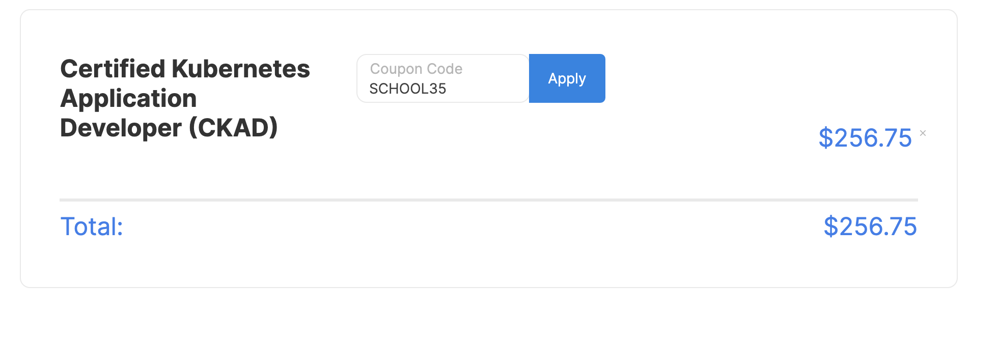
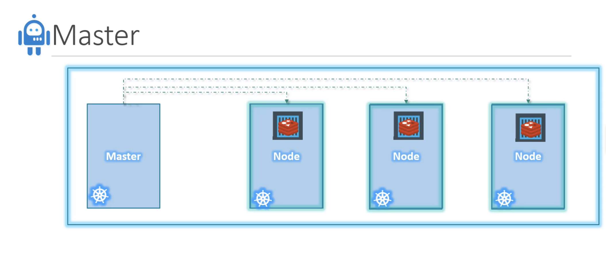
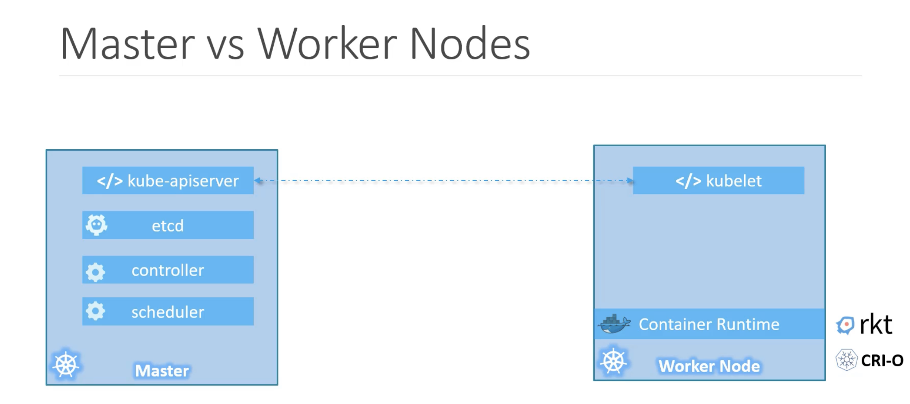
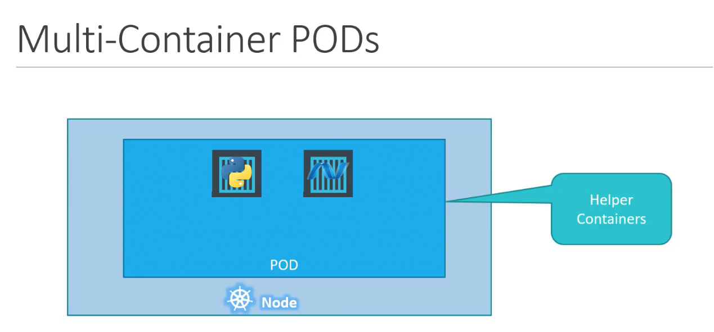

date:: [[Aug 13th, 2022]]
type:: #[[task-note]]
name:: kodekloud engineer 
tags:: #每日推進

date:: [[Aug 27th, 2022]]
type:: #[[target-note]]
name::
tags::

## TODOs
collapsed:: true

- {{query (and (todo todo doing later) (page [[certified k8s application developer (ckad)]]))}}

## 目標

- 考上 CKAD，取得證照可以放到履歷上
	  collapsed:: true
	- CKAD 全名 Certified K8s Application Developer，是 Google 為 Kubernetes 出的證照之一
	- 具有設計、build、問題查找、監控、設定以及公開 k8s 雲服務的能力
	- 原本只是想練習 k8s 部署技巧，但如果練習都沒有個成果，對未來也沒有幫助

- 證照要價 $395 美金 ~= 12000 NTD，折價卷使用後還是要 7747 NTD
	  collapsed:: true
	- 一定要用 Paypal honey plugin
		- 折價卷 `SCHOOL35`，折完剩下 256.75 USD ~= 7747 NTD
		- 


## 目標對象

- 我自己，想成為了解部屬的全端工程師

## 下一步行動

- ### 成為 kodekloud engineer DevOps Engineer
	  background-color:: gray
	  id:: fa05a780-7630-482b-bf06-31e1c9890a34
	- Start with jump server
		  collapsed:: true
		- ssh 22 connect to the target server
	- 資源
		  collapsed:: true
		- [Architecture](https://lucid.app/lucidchart/58e22de2-c446-4b49-ae0f-db79a3318e97/view?page=0_0#)
		- [Nautilus 專案簡介](https://kodekloudhub.github.io/kodekloud-engineer/docs/projects/nautilus)
	- 目前 Level: Systems Administrator
		  collapsed:: true
		- DONE [[CKAD/Linux file permissions]]
			  :LOGBOOK:
			  CLOCK: [2022-08-13 Sat 15:21:36]--[2022-08-13 Sat 15:21:36] =>  00:00:00
			  :END:
		- DONE [[CKAD/linux timezones setting]]
			  :LOGBOOK:
			  CLOCK: [2022-08-14 Sun 16:36:05]--[2022-08-14 Sun 16:56:03] =>  00:19:58
			  :END:
		- DONE [[CKAD/Create a Linux User with non-interactive shell]]
			  :LOGBOOK:
			  CLOCK: [2022-08-15 Mon 22:32:59]--[2022-08-17 Wed 22:41:59] =>  48:09:00
			  :END:
		- DONE [[CKAD/Linux User Files]]
			  :LOGBOOK:
			  CLOCK: [2022-08-17 Wed 22:42:35]--[2022-08-20 Sat 07:05:05] =>  56:22:30
			  :END:
		- DONE [[CKAD/Linux Remote Copy]]
			  :LOGBOOK:
			  CLOCK: [2022-08-20 Sat 07:05:35]--[2022-08-20 Sat 07:19:42] =>  00:14:07
			  :END:
		- DONE 🔃  [[CKAD/MariaDB Troubleshooting]]
			  collapsed:: true
			- 應該要更仔細看錯誤訊息
		- DONE [[CKAD/Linux Services]]
		- DONE [[CKAD/Linux User Expiry]]
		- DONE [[CKAD/Linux User Without Home]]
			  :LOGBOOK:
			  CLOCK: [2022-08-27 Sat 08:03:46]--[2022-08-27 Sat 08:20:53] =>  00:17:07
			  :END:
		- DONE [[CKAD/Linux Banner-MOTD]]
			  :LOGBOOK:
			  CLOCK: [2022-08-28 Sun 17:15:00]--[2022-08-28 Sun 18:14:17] =>  00:59:17
			  :END:
		- DONE [[CKAD/Linux SSH Authentication]]
		- DONE [[CKAD/Linux Run Levels]]
		- DONE [[CKAD/DNS Troubleshooting]]
			  :LOGBOOK:
			  CLOCK: [2022-09-03 Sat 11:56:14]--[2022-09-03 Sat 12:28:35] =>  00:32:21
			  :END:
		- DONE [[CKAD/Linux Collaborative Directories]]
			  collapsed:: true
			- chmod 原來有 special bits 可以使用，可以設定 `uid`
		- DONE [[CKAD/Linux String Substitute]]
			  collapsed:: true
			- `sed -i` instead of `:%s/A/B/g` in `vi`
		- DONE [[CKAD/Disable Root Login]]
		- DONE [[CKAD/Linux NTP Setup]]
		- DONE [[CKAD/Create a Cron Job]]
			  id:: 631d1984-f764-41e6-bbe2-acf5457f7bb8
		- DONE [[CKAD/Selinux Installation]]
			  id:: 632073bd-48a1-4f7d-aefe-5d314671f25f
			  :LOGBOOK:
			  CLOCK: [2022-09-13 Tue 20:12:52]--[2022-09-13 Tue 20:46:14] =>  00:33:22
			  :END:
		- DONE [[CKAD/Linux Postfix Troubleshooting]]
			  id:: 6322578f-917b-4698-9575-537d0481d356
			  :LOGBOOK:
			  CLOCK: [2022-09-15 Thu 06:37:42]--[2022-09-15 Thu 06:57:46] =>  00:20:04
			  :END:
		- DONE [[CKAD/Linux String Substitute (sed)]]
		- DONE [[CKAD/Application Security]]
			  :LOGBOOK:
			  CLOCK: [2022-09-19 Mon 21:25:06]--[2022-09-19 Mon 21:45:43] =>  00:20:37
			  :END:
		- DONE [[CKAD/Linux Find Command]]
		- DONE [[CKAD/Linux LogRotate]]
			  :LOGBOOK:
			  CLOCK: [2022-09-27 Tue 06:44:07]--[2022-09-27 Tue 08:06:10] =>  01:22:03
			  :END:
		- DONE [[CKAD/Configure Local Yum repos]]
			  id:: 6334cb84-2a91-43ce-9698-366a7c30c28b
		- DONE [[CKAD/Add Response Headers in Apache]]
		- DONE [[CKAD/Linux Bash Scripts]]
		- DONE [[CKAD/Setup SSL for Nginx]]
		- TODO 研讀[網路概論](https://jonny-huang.github.io/else/01_net_01/)，列出自己想了解的部分

- ### 準備 CKAD 證照
	  background-color:: #793e3e
	- > 因為 Systems Administrator 的任務都太簡單了，想雙管齊下，但好像又沒有這麼多時間？
	- ### [Certified Kubernetes Application Developer (CKAD)](https://kodekloud.com/topic/kubernetes-series-of-courses/) 課程
		- #### Recap
			- #### Nodes (Minions)
				  collapsed:: true
				- **Node** is a ==worker machine== and that is where containers will be launched by Kubernetes
				- Fails when application goes down, so you need to have more than one Node
			- #### Cluster
				  collapsed:: true
				- A set of nodes grouped together, if one node fails your application still accessible from other Nodes
				- Multiple **Nodes** help in sharing the load
				- #### Master
					  collapsed:: true
					- 
					- A **node** to manage the **nodes** in the **Cluster**
						- watch the nodes in the cluster
						- Orchestration of containers on the worker Nodes
				- ### Master vs Worker Nodes
					- 
			- #### Components
				  collapsed:: true
				- Install Kubernetes on a system will install the following components
					- API Server
						- The API server is a component of the Kubernetes [control plane](https://kubernetes.io/docs/reference/glossary/?all=true#term-control-plane) that exposes the Kubernetes API. The API server is the front end for the Kubernetes control plane.
					- etcd
						- Consistent and highly-available key value store used as Kubernetes' backing store for all cluster data.
						- Implementing locks within the cluster to ensure that there're no conflicts between the **Masters**
					- Scheduler
						- watches for newly created [Pods](https://kubernetes.io/docs/concepts/workloads/pods/) with no assigned [node](https://kubernetes.io/docs/concepts/architecture/nodes/), and selects a node for them to run on.
					- Controller
						- The brain behind the orchestration
						- Responsible for noticing and responding when nodes, containers or endpoints goes down
							- Make decisions to bring up new containers
					- Container Runtime
						- The container runtime is the software that is responsible for running containers.
						- Docker or other options ( (rkt)Rocket, CRI-O)
					- kubelet
						- The agent that runs on each node in the clusters
						- Responsible for making sure that the containers are running on the nodes as expected


			- #### kubectl
				  collapsed:: true
				- kube control tool is used to deploy and manage applications on a Kubernetes cluster
				- ```bash
					  kubectl run hello-minikube
					  kubectl cluster-info
					  kubectl get nodes
					  ```
			- #### DONE PODs
				  :LOGBOOK:
				  CLOCK: [2022-08-28 Sun 08:23:10]--[2022-08-28 Sun 22:56:14] =>  14:33:04
				  :END:
				- Containers in Pods have the **same network namespace** and same fate, which will be **created together and destroyed together**
				- Pods **usually** have a one-to-one relationship with containers running your application
					  collapsed:: true
					- scale up: create new Pods
					- scale down: delete existing Pods
				- But Single Pod can have **multiple containers**
					  collapsed:: true
					- helper containers which aim to supporting task of out web application
					- live alongside of application container
					- 

				- `kubectl`
					  collapsed:: true
					- download and run pod
						- ```bash
							  kubectl run nginx --image nginx
							  ```
							- download the image from Docker Hub
					- List pods
						- ```bash
							  kubectl get pods
							  ```


- ### 報名 CKAD
	  background-color:: #978626
	- [證照連結](https://training.linuxfoundation.org/certification/certified-kubernetes-application-developer-ckad/?SSAID=1308175&sscid=81k6_tzxj4)
	- [Candidate Handbook](https://docs.linuxfoundation.org/tc-docs/certification/lf-handbook2/candidate-requirements)
	- 考試時可以看哪些資源？官方文件
		  collapsed:: true
		- During the CKA & CKAD exam, candidates may:
			- review the Exam content instructions that are presented in the command line terminal
			- review Documents installed by the distribution (i.e. /usr/share and its subdirectories)
			- use the browser within the VM to access documentation at: [https://helm.sh/docs/](https://helm.sh/docs/), [https://kubernetes.io/docs/](https://kubernetes.io/docs/), [https://kubernetes.io/blog/](https://kubernetes.io/blog/) and their subdomains. This includes all available language translations of these pages (e.g. [https://kubernetes.io/zh/docs/)](https://kubernetes.io/zh/docs/home/)
			- _use the search function provided on_ [_https://kubernetes.io/docs/_](https://kubernetes.io/docs/)_. However, you may only open search results that have a domain matching the ones specified above._
	- 有地方可以模擬考嗎？報名後有考試模擬器
		  collapsed:: true
		- Candidates who register for the [Certified Kubernetes Administrator (CKA)](https://training.linuxfoundation.org/certification/certified-kubernetes-administrator-cka/), [Certified Kubernetes Application Developer (CKAD)](https://training.linuxfoundation.org/certification/certified-kubernetes-application-developer-ckad/), and [Certified Kubernetes Security Specialist (CKS)](https://training.linuxfoundation.org/certification/certified-kubernetes-security-specialist/) exams will have access to an ==exam simulator==, provided by [Killer.sh](https://killer.sh/).
		- Login to [My Portal](https://trainingportal.linuxfoundation.org) and click Start/Resume to view your exam preparation checklist. The link to the Simulator is available on the "Schedule Exam" checklist item.
		- Candidates will have two attempts (per exam registration). Each attempt grants 36 hours of access starting from the time of activation. The exam simulations include 20-25 questions similar to the ones candidates can expect to encounter on the real exam.

## 暫時不做
