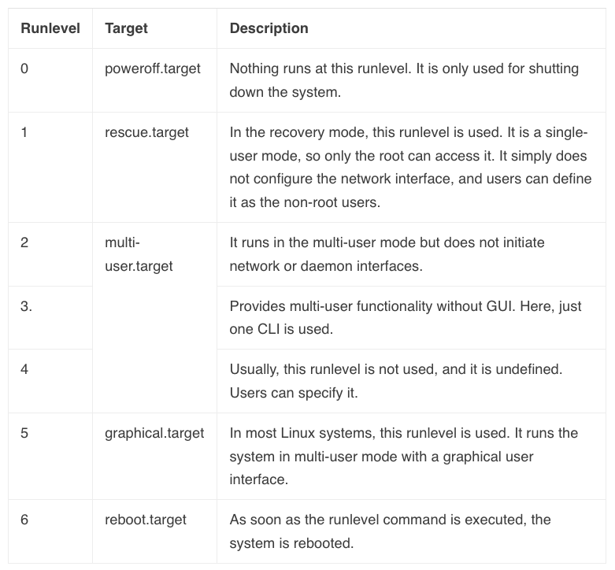

title:: CKAD/Linux Run Levels
public:: true

- date:: [[Sep 1st, 2022]]
  type:: #task-note
  name::
  tags::
- ## TODOs
- ## 下一步行動
	- {{embed ((0d87cbaf-0e4a-4cde-8a74-d2e1b549caa1))}}
	- ### Change Linux default runlevel
	  background-color:: #49767b
	  id:: d4212c23-ad9c-4a61-a6f1-c2585058e3cf
		- New tools have been installed on the app server in `Stratos Datacenter`. Some of these tools can only be managed from the graphical user interface. Therefore, there are requirements for these app servers.
		- On all App servers in `Stratos Datacenter` **change the default runlevel** so that they can boot in `GUI (graphical user interface)` by **default**. ==Please do not try to reboot these servers==
		- #### Runlevel in Linux
			- Runlevel is a different mode used for the various tasks in Linux
			- Switch runlevel as an admin
		- #### SSH to the server
		- #### Steps
			- get current runlevel
				- ```bash
				  $ runlevel
				  # N” means that your system was not previously at a different runlevel. 
				  # And “5” means that your system’s current runlevel is 5.
				  N 5
				  # OR
				  $ who -r
				  ```
			- Check runlevel help
				- ```bash
				  $ runlevel --h
				  ```
			- GUI should be level 5
				- 
			- Runlevel files location
				- `ls /etc`
					- Runlevel files are organized into these directories in `rc0.d` to `rc6.d`  formation.
			- Change runlevel and restart system
			  collapsed:: true
				- ```bash
				  $ init <runlevel_value>
				  # OR
				  $ telinit <runlevel_value>
				  ```
			- Change runlevel without restart system
				- Get current runlevel
					- ```bash
					  $ systemctl get-default
					  ```
				- ❌ Change run level
				  collapsed:: true
					- `sudo systemctl isolate graphical.target`
					- The requirement is set default target
					- ```bash
					  $ sudo systemctl isolate <runlevel_target>
					  
					  ```
				- > 👉 Set default target
					- `systemctl set-default graphical.target`
					- ```bash
					  $ systemctl set-default TARGET.target
					  ```
		- #### Verify result
			- Check with `runlevel` or `systemctl get-default` or `who -r` commnads
- ## 為誰為何而做?
- ## 如何量化成果？
	- ((d4212c23-ad9c-4a61-a6f1-c2585058e3cf))
	-
- ## 有何阻礙限制？
- ## Related