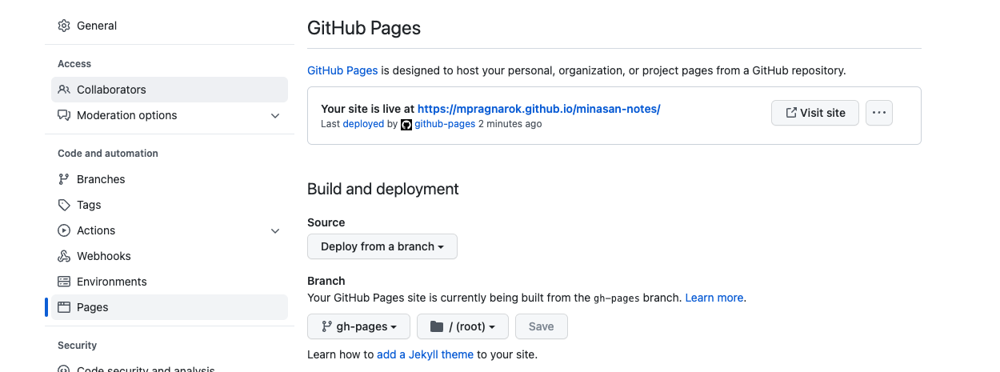

date:: [[Oct 22nd, 2022]]
type:: #task-note
name:: Publish Logseq automatically
title:: Publish Logseq public pages
tags::
related::

- ## TODOs
  collapsed:: true
	- {{query (and (todo todo doing later) (page [[publish logseq automatically]]))}}
	-
- ## ❓ Why am I doing this?
	- > Logseq is hard to share the pages, and I'm too lazy to copy-paste all the public notes to the graph all the time. Therefore, I spent an afternoon setting all this up 🥰
- ## Publish your local graph into the GitHub page with ((6354a051-5b5e-4a33-906f-e1cfb63221fa)) and command lines in OSX
  background-color:: green
	- ### Prerequisites
	  collapsed:: true
		- Create a new Logseq graph name `logseq-public` for publishing which locate next to your original Logseq graph
			- ```
			  .
			  ├── logseq-public # new Logseq graph for publishing
			  └── vaults # your original Logseq graph
			  ```
			- `All pages public when publishing` should be open in `logseq-public` graph
			- 
		- [Create GitHub repository](https://docs.github.com/en/get-started/quickstart/create-a-repo) for `logseq-public` graph with public visibility
			- Checkout ((6354f645-311f-4ccd-89dd-0f0b779d88c5))
		- Makefile: All the commands we need
			- ```
			  .
			  ├── logseq-public # new Logseq graph for publishing
			  └── vaults # Download Makefile here
			  ```
			- Download `Makefile` with curl below in your original Logseq graph directory
			  collapsed:: true
				- ```bash
				  curl https://raw.githubusercontent.com/mpragnarok/learning/main/common/Makefile/logseq-publish/Makefile -o Makefile
				  ```
	- ### Get shells with `make get-shells`
	  collapsed:: true
		- `logseq-publish.sh`
			- Run the commands which from Makefile
			- `clean-and-export-assets`
				- Remove all the files exported last time
				- Export all the assets referenced in public notes
			- `clean-and-grep-public`
				- Remove all the pages exported by `logseq-export`
				- Grep the files which have `public:: true` property and tar into `logseq-public/pages` directory
			- `find-and-remove-private-content`
				- Find all the files under `logseq/pages`
				- Remove all the contents which wrap with `- #+BEGIN_PRIVATE` and `-  #+END_PRIVATE`
		- `sync.sh`
			- auto-commit the files
	- ### Get GitHub workflow config with `make get-workflow` for publish and deploy
	- ### [[Hide private content]]: Remove the content which wrapped with `#+BEGIN_PRIVATE` and `#+END_PRIVATE`
	- ### [logseq-export](https://github.com/viktomas/logseq-export)
	  id:: 6354a051-5b5e-4a33-906f-e1cfb63221fa
		- For exporting assets
		- Install: `make install-logseq-export`
		- The reason that I'm not using this package to export all public pages
			- ### The markdown files that I tried to export with `logseq-export` will result in the title of the page has additional double quotes`""`.
	- ### Publish Logseq graph with one line command
	  collapsed:: true
		- Run `pwd` to get the `SOURCE_VAULT` and `TARGET_VAULT` paths and fill in `Makefile` variables
			- ```
			  SOURCE_VAULT = /Users/minahuang/Documents/vaults
			  TARGET_VAULT = /Users/minahuang/Documents/logseq-public
			  ```
		- `make publish`
			- ```bash
			   ~/Documents/vaults | on main !1 --------------------------------- took 10s | base py | at 16:49:21 
			  > make publish
			  sh logseq-publish.sh && cd /Users/minahuang/Documents/logseq-public && sh sync.sh
			  rm -rf /Users/minahuang/Documents/logseq-public/logseq/bak/pages/*
			  rm -rf /Users/minahuang/Documents/logseq-public/assets/*
			  rm -rf /Users/minahuang/Documents/logseq-public/pages/*
			  logseq-export \
			                  --graphPath /Users/minahuang/Documents/vaults/pages \
			                  --blogFolder /Users/minahuang/Documents/logseq-public/pages \
			                  --unquotedProperties date,name,public,tags \
			                  --assetsRelativePath ../assets \
			                  --webAssetsPathPrefix ../assets
			  rm -rf /Users/minahuang/Documents/logseq-public/pages/*
			  LC_ALL=C find /Users/minahuang/Documents/logseq-public/pages -type f | xargs -I@ sed -i '' '/^- #+BEGIN_PRIVATE/,/^- #+END_PRIVATE/d' @
			  /Users/minahuang/Documents/logseq-public
			  [main f17fb29]  M "pages/Publish Logseq automatically.md"
			   1 file changed, 55 insertions(+), 102 deletions(-)
			  remote: Enumerating objects: 382, done.
			  remote: Counting objects: 100% (382/382), done.
			  remote: Compressing objects: 100% (286/286), done.
			  remote: Total 382 (delta 95), reused 373 (delta 95), pack-reused 0
			  Receiving objects: 100% (382/382), 35.94 MiB | 6.30 MiB/s, done.
			  Resolving deltas: 100% (95/95), done.
			  From https://github.com/mpragnarok/minasan-notes
			   + 0e66fcc...70acc2f gh-pages   -> origin/gh-pages  (forced update)
			  Current branch main is up to date.
			  Enumerating objects: 7, done.
			  Counting objects: 100% (7/7), done.
			  Delta compression using up to 10 threads
			  Compressing objects: 100% (4/4), done.
			  Writing objects: 100% (4/4), 1.74 KiB | 1.74 MiB/s, done.
			  Total 4 (delta 2), reused 0 (delta 0), pack-reused 0
			  remote: Resolving deltas: 100% (2/2), completed with 2 local objects.
			  To https://github.com/mpragnarok/minasan-notes.git
			     7a240d9..f17fb29  main -> main
			  ```
	- ### Configure Github pages
	  collapsed:: true
		- 
		- `Settings > Github Pages > Build and deployment`
			- Source: Deploy from a branch
			- Branch: `gh-pages` `/ root`
		- Checkout ((6355016a-8236-44d4-80c7-08224a4194b6))
	- ### Reference
		- [My public Logseq notes](https://mpragnarok.github.io/minasan-notes/)
		  id:: 6355016a-8236-44d4-80c7-08224a4194b6
		- [My public Logseq notes repository](https://github.com/mpragnarok/minasan-notes)
		  id:: 6354f645-311f-4ccd-89dd-0f0b779d88c5