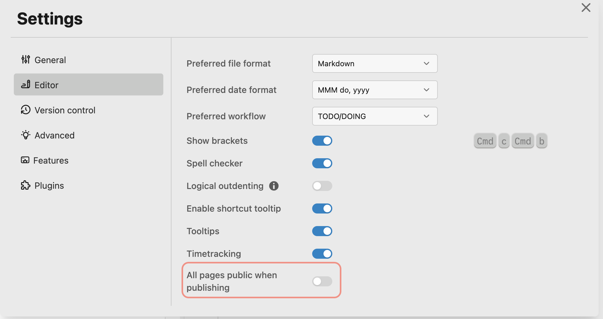

## TODOs
collapsed:: true

- {{query (and (todo todo doing later) (page [[publish logseq automatically]]))}}


## 下一步行動

- ### Automate publish your local graph on the GitHub page with ((6354a051-5b5e-4a33-906f-e1cfb63221fa)) and command lines in OSX
	  background-color:: green
	- Prerequisites
		- Create a new Logseq graph name `logseq-public` for publishing which locate next to your original Logseq graph
			- ```
				  .
				  ├── logseq-public # new Logseq graph for publishing
				  └── vaults # your original Logseq graph
				  ```
			- `All pages public when publishing` should be open in `logseq-public` graph
			- 
		- [Create GitHub repository](https://docs.github.com/en/get-started/quickstart/create-a-repo) for `logseq-public` graph

		- Create `Makefile` with content below into your original Logseq graph directory
			- ```
				  .
				  ├── logseq-public # new Logseq graph for publishing
				  └── vaults # Create make file here
				  ```
			- ```Makefile
				  #
				  # autor: mpragnarok
				  # 
				  #
				  
				  .EXPORT_ALL_VARIABLES:
				  #
				  # var for Makefile to run database or some shared resources
				  #
				  SOURCE_VAULT = 
				  TARGET_VAULT = 
				  
				  
				  install-logseq-export:
				  	go install github.com/viktomas/logseq-export@latest
				  
				  clean-bak:
				  	rm -rf ${TARGET_VAULT}/logseq/bak/pages/*
				  clean-assets:
				  	rm -rf ${TARGET_VAULT}/assets/*
				  
				  clean-pages:
				  	rm -rf ${TARGET_VAULT}/pages/*
				  
				  clean-all: clean-bak clean-assets clean-pages
				  
				  logseq-export-assets:
				  	logseq-export \
				  		--graphPath ${SOURCE_VAULT}/pages \
				  		--blogFolder ${TARGET_VAULT}/pages \
				  		--unquotedProperties date,name,public,tags \
				  		--assetsRelativePath ../assets \
				  		--webAssetsPathPrefix ../assets
				  
				  setup-and-export-assets: install-logseq-export logseq-export-assets
				  
				  sleep-%:
				  	sleep $(@:sleep-%=%)
				  
				  define grep-public
				  grep -lir 'public:: true' ./pages
				  endef
				  
				  # `tar` avoid to use full path of directory
				  grep-public-markdown: 
				  	@$(grep-public) | tar -T - -c | tar -xpC ../logseq-public
				  	
				  	
				  clean-and-generate-assest: clean-all logseq-export-assets 
				  clean-and-grep-public: clean-pages grep-public-markdown
				  
				  # -i '' works with BSD and GNU sed
				  # [the solution of `sed` recursively in OSX version](https://www.cyberciti.biz/faq/unix-linux-replace-string-words-in-many-files/#comment-68305)
				  find-and-remove-private-content:
				  	LC_ALL=C find ${TARGET_VAULT}/pages -type f | xargs -I@ sed -i '' '/^- #+BEGIN_PRIVATE/,/^- #+END_PRIVATE/d' @
				  
				  publish:
				  	sh logseq-publish.sh && cd ${TARGET_VAULT} && sh sync.sh
				  
				  
				  ```
	- [logseq-export](https://github.com/viktomas/logseq-export): For exporting assets
		  id:: 6354a051-5b5e-4a33-906f-e1cfb63221fa
		- Install: `make`
		- The reason that I'm not using this package to export all public pages
			- The markdown files that I tried to export with `logseq-export` will result in the title of the page has additional double quotes`""`.
	- Grep a copy of markdown files with property: `public:: true`
		- ```
			  ```

- ### 階段性成果 B: 現階段可完成、與我有關
	  background-color:: purple


## 為誰為何而做?

- 誰的需求？

- 要達成目的

## 如何量化成果？

- 時間成果

- 數量成果

- 特殊成果

## 有何阻礙限制？

- 準備的阻礙

- 執行的阻礙

- 結案的阻礙