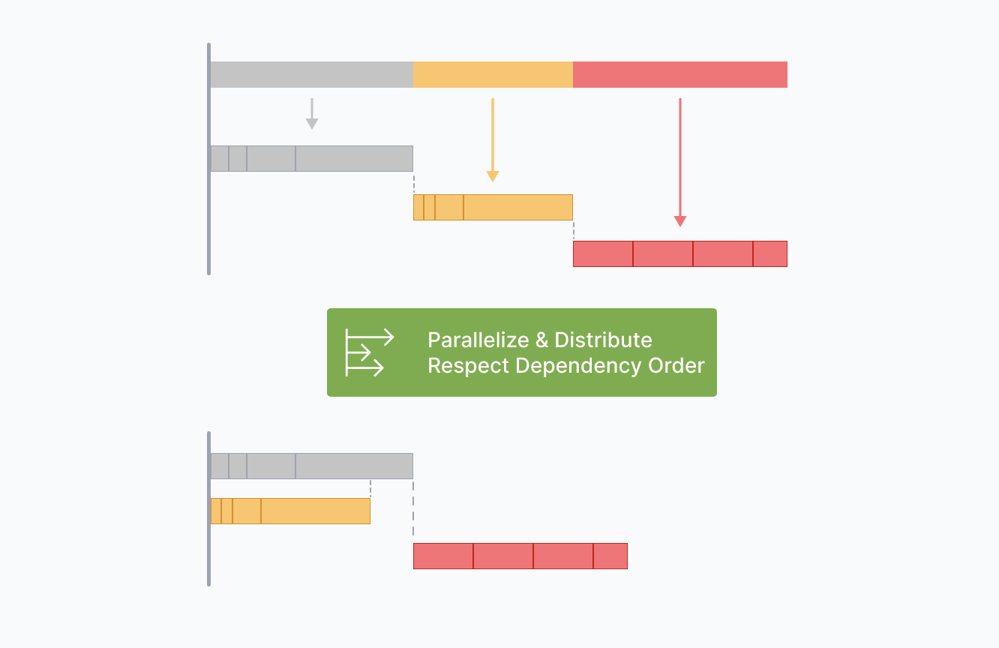
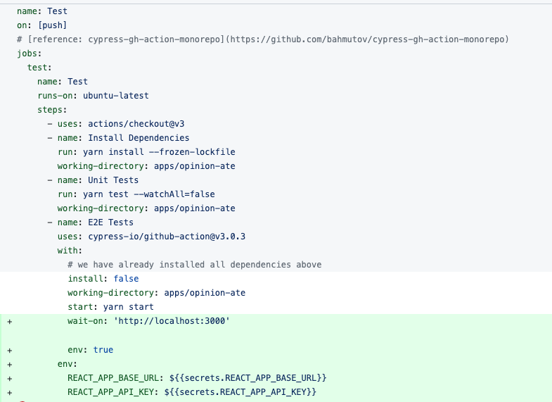
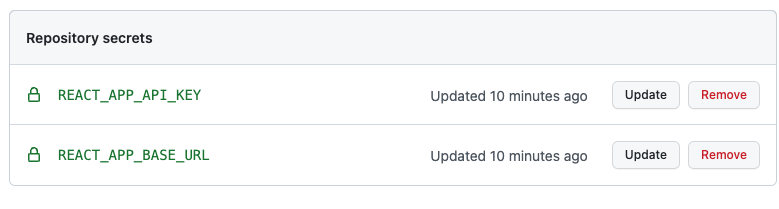
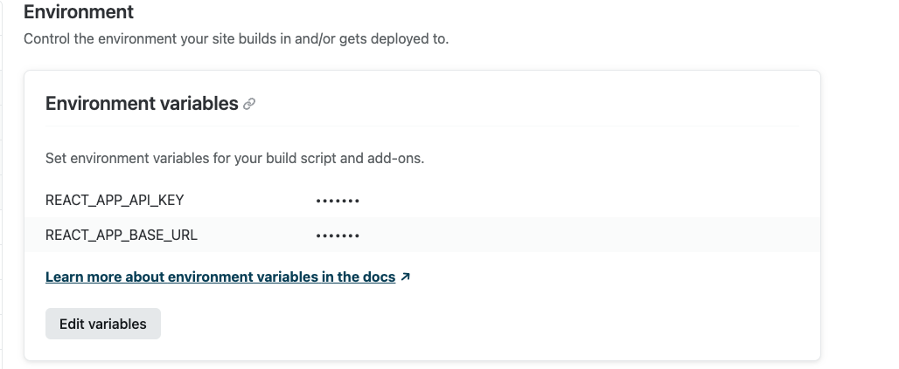
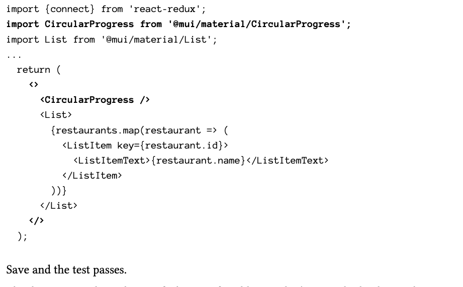
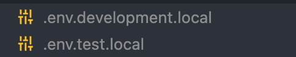

date:: [[Sep 2nd, 2022]]
type:: #task-note
name:: outside-in frontend development
tags:: 每日推進, 哪次不做
pdf:: 
repo:: https://github.com/CodingItWrong/opinion-ate-react
icon:: 👩‍💻
public:: true

- ## TODOs
  collapsed:: true
	- {{query (and (todo todo doing later) (page [[outside-in frontend development]]))}}
	-
- ## 下一步行動
	- ###  Finished Tutorial
	  id:: 6312190d-31d0-4932-9f5c-f1a825d69106
	  background-color:: #264c9b
		- ### Setup project
			- git commit
			- #### DONE Set Up Development Environment
			- #### DONE Create App
			- #### DONE Set Up Autoformatting
		- ### mono-repo: Nx
			- [team sharing reference](https://hackmd.io/s3gTCENcQquvtNU-o7LI_A?view#%E7%B5%90%E8%AA%9E)
				- [video](https://www.facebook.com/watch/?v=607293137699049&extid=CL-UNK-UNK-UNK-AN_GK0T-GK1C&ref=sharing)
			- SWC benfits
				- > SWC is 20x faster than Babel on a single thread and 70x faster on four cores.
				- Steps of migrating from Babel
					- 1.  Webpack 耗時觀測：
						- Babel 耗時太久，才考慮改用 SWC
							- 1.  [speed-measure-webpack-plugin](https://www.npmjs.com/package/speed-measure-webpack-plugin)
							- 2.  [@datadog/build-plugin](https://www.npmjs.com/package/@datadog/build-plugin)(但這個每週下載量很少)
					- 2.  處理 Babel plugin
						- 1.  移除不必要的 babel plugin
						- 2.  改用 pre-build 的方案（比如每次 build 出來都長一樣的東西，圖片壓縮等）
						- 3.  使用 SWC plugin 取代(參考[官網](https://swc.rs/docs/migrating-from-babel))
			- Nx benefits
				- Local Task Orchestration
					- 把指令做最佳化，能依照正確順序、平行地（花費最短時間）執行
					- 
				- Computation Caching
					- 和 React 一樣，Nx 也有 tree diffing 的機制，會去比對當前這一個 command 結果和 cache 裡的結果，如果一樣的話，就會拿前一次執行的結果 replay。
		- ### DONE Set Up Tests On CI
			- DONE Install [Cypress](https://www.cypress.io/) for end-to-end tests at local
			  collapsed:: true
				- ```bash
				  $ yarn add --dev cypress@9.6.0
				  ```
				-
			- #### DONE Add cypress e2e testing action in  Github workflow action monorepo
			  :LOGBOOK:
			  CLOCK: [2022-09-09 Fri 15:35:15]--[2022-09-09 Fri 15:40:25] =>  00:05:10
			  :END:
				- I'm trying to use mono-repo in Github, and the GitHub CI is not working as expected
				- Then I found an example,  [cypress-gh-action-monorepo](https://github.com/bahmutov/cypress-gh-action-monorepo) to show to setup cypress in GitHub mono-repo
					- test.yml
						- path: `.github/workflows/test.yml`
						- ```yml
						  name: Test
						  on: [push]
						  # [reference: cypress-gh-action-monorepo](https://github.com/bahmutov/cypress-gh-action-monorepo)
						  jobs:
						    test:
						      name: Test
						      runs-on: ubuntu-latest
						      steps:
						        - uses: actions/checkout@v3
						        - name: Install Dependencies
						          run: yarn install --frozen-lockfile
						          working-directory: apps/opinion-ate
						        - name: Unit Tests
						          run: yarn test --watchAll=false
						          working-directory: apps/opinion-ate
						        - name: E2E Tests
						          uses: cypress-io/github-action@v3.0.3
						          with:
						            # we have already installed all dependencies above
						            install: false
						            working-directory: apps/opinion-ate
						            start: yarn start
						            wait-on: 'http://localhost:3000'
						  ```
					- The [action](https://github.com/mpragnarok/learning/runs/8265317426?check_suite_focus=true) is working as expected
			- DONE Set up Cypress in [gitlab ci](https://docs.cypress.io/guides/continuous-integration/gitlab-ci.html?utm_source=Test%20Runner&utm_medium=CI%20Prompt%201&utm_campaign=GitLab&utm_content=Automatic)
			  :LOGBOOK:
			  CLOCK: [2022-09-14 Wed 06:57:35]--[2022-10-04 Tue 06:57:31] =>  479:59:56
			  :END:
		- ### DONE Set Up Automatic Deployment
			- [Netlify with monorepo](https://docs.netlify.com/configure-builds/monorepos/)
				- DONE should set [Base directory](https://docs.netlify.com/configure-builds/monorepos/#base-directory)
		- ### DONE Fill In Readme
		- ### TDD principles
			- tests fail first
			- check one behavior per test in unit tests
			- whenever the tests go green, look for opportunities to refactor
			- Don't mock what you don't own
				- test doubles for code you don't own, not just mocks.
				- reason
					- You can't control other library's behavior, if it change later on
					- You don't get control of the library's API
				- **How can I test if shouldn't mock third-party dependencies?** #card
				  id:: 631bf988-bea7-4731-8cea-1b01a7724918
				  card-last-interval:: 4
				  card-repeats:: 1
				  card-ease-factor:: 2.36
				  card-next-schedule:: 2022-10-24T23:27:00.986Z
				  card-last-reviewed:: 2022-10-20T23:27:00.987Z
				  card-last-score:: 3
					- > 👉 Wrap the third-party code with your own interface that you do control, don't mock that
						- In our case, we created an `api` interface with a `loadRestaurants()` in unit testing
							- ```js
							  // apps/opinion-ate/src/store/restaurants.spec.js
							  const api = {
							    loadRestaurants: () => Promise.resolve(records),
							  };
							  ```
			- How to distinguish the scope between Unit test  and End-to-end testing? #card
				- main path by E2E tests
				- Edge cases by Unit tests
					- Test the details in unit tests
			- Testing the interface, not the implementation
			- Don't specify Markup and styles in tests
			  id:: 631c3a45-c442-4669-9b62-b1c9e3ba5898
				- Don't write any behavioral production code without a failing test
				  collapsed:: true
					- ((631c3a21-870c-4c19-bed2-dab0d74346a9))
				- Keep component tests focused on behavior
					- ((631c3a93-5899-4bfc-bc7f-6ead6f447718))
			- we should not try to sequence our tests and reuse state
				- ((631d7dfe-103e-4e5b-9e84-01876ebdd54b))
		- ### DONE Vertical Slice - List Restaurants
		  :LOGBOOK:
		  CLOCK: [2022-09-09 Fri 16:16:16]--[2022-10-03 Mon 14:29:24] =>  574:13:08
		  :END:
			- List restaurants touch all layers of code, as a minimize work
				- user interface
				- data layer
				- API client
			- > Why use `connect()` instead of using the newer react hook-based API?
				- The author use `connect()` in `redux` instead of newer cause it's a natural fit for testing approach passing props to a component
					- > ((631b0c14-cbe9-42fc-a58f-1e9bf6105ed4))
			- TODO How can I test with redux hook pattern such as `useSelecter`
			  id:: 631b0af2-18d2-446d-858a-6c01eea5bb08
				- But if I mix useSelector and component them together, I cannot separate redux from it
				- > ((631b0b67-e5a5-4d14-b8db-ec3492d4eafa))
			- create test for store
				- path: `apps/opinion-ate/src/store/restaurants.spec.js`
				- Dependency Injection
					- TODO what is dependency injection?
					- `thunk.withExtraArgument()` is a dependency injection method
					- Dependency injection is safer than override dependency with hard coding such as [Jest module mocking](https://jestjs.io/docs/mock-functions#mocking-modules)
						- ((631b1e41-d505-48da-9827-5d789f523c30))
					-
			- Don't unit test on building the API client
				- principle
					- ((631bf7b1-a154-40cc-a22a-0969fd0df238))
				- ((631bf988-bea7-4731-8cea-1b01a7724918))
				- E2E tests stub the actual HTTP request
					- ```js
					  // apps/opinion-ate/cypress/integration/listing-restaurants.spec.js
					  describe('Listing Restaurants', () => {
					    it('shows restaurants from the server', () => {
					      const sushiPlace = 'Sushi Place';
					      const pizzaPlace = 'Pizza Place';
					      // stub api request
					      cy.intercept('GET', 'https://api.outsidein.dev/*/restaurants', [
					        {id: 1, name: sushiPlace},
					        {id: 2, name: pizzaPlace},
					      ]);
					      cy.visit('/');
					      cy.contains(sushiPlace);
					      cy.contains(pizzaPlace);
					    });
					  });
					  
					  ```
				- Add environment variables in github actions
					- GitHub workflows: `test.yml`
						- [reference](https://github.com/cypress-io/github-action/issues/85#issuecomment-586733897)
						- add `env: true` under `with`
						- add `env` section
						- 
						-
					- Add secret in GitHub
					  collapsed:: true
						- Settings > Secrets > Actions
							- 
					- Add secret in Netlify
						- Site Settings > Build & deploy > Environment
						- 
		- ### Refactoring Styles - Style App with Material Design
		  collapsed:: true
			- Install MUI packages
			  collapsed:: true
				- ```bash
				   yarn add \
				  @mui/material@5.8.2 \
				  @emotion/react@11.9.0 \
				  @emotion/styled@11.8.1
				  ```
			- ((631c3a45-c442-4669-9b62-b1c9e3ba5898))
		- ### DONE Edge Cases - Show Loading and Error States
		  id:: 6313009b-cac8-44ce-b976-2011595f58b7
		  :LOGBOOK:
		  CLOCK: [2022-09-11 Sun 07:27:58]--[2022-09-11 Sun 21:10:00] =>  13:42:02
		  :END:
			- Write less **integration test** - each main flow of the application
			  collapsed:: true
				- more tests, your test suite will get slow
				- slow down local testing and CI runs
				- fewer E2E tests than unit tests
				  collapsed:: true
					- ((631c423e-c08e-4a3b-9d03-d9a30137788d))
			- **Unit tests** to help implement the main flow
			  collapsed:: true
				- more detailed or edge-case
			- Test in detail with unit level but forego and E2E tests
				- Loading Indicator
					- Component Layer
					  collapsed:: true
						- use [ARIA role](https://developer.mozilla.org/en-US/docs/Web/Accessibility/ARIA/Roles) to check the test case
							- path: `apps/opinion-ate/src/components/RestaurantList.spec.js`
							- ```js
							    it('displays the loading indicator while loading', () => {
							      renderComponent({loading: true});
							      expect(screen.getByRole('progressbar')).toBeInTheDocument();
							    });
							  ```
						- Make the test pass first
							- cause the conditional is not tested
							- 
					- Data Layer - loading flag
					  collapsed:: true
						- test asynchrony
							- Return promise in Jest `beforeEach` block if we want Jest to resolve
								- {{embed ((631c5fa2-1bf3-4d1b-bd30-d554b1289296))}}
				- DONE Error message
				  :LOGBOOK:
				  CLOCK: [2022-09-10 Sat 19:02:52]--[2022-09-14 Wed 05:46:03] =>  82:43:11
				  :END:
					- ((631d2009-8121-440c-b657-ab11e1d95f74))
					- ((631d2015-a21c-41c6-9df4-c0125e699f68))
		- ### Add Restaurants
		  collapsed:: true
			- Integration test
				- Cypress's docs
				  collapsed:: true
					- [its()](https://docs.cypress.io/api/commands/its)
					- [should()](https://docs.cypress.io/api/commands/should)
					- [BDD Assertions](https://docs.cypress.io/guides/references/assertions#BDD-Assertions).
				- Make sure we send the right data to the backend, that's why we don't stub the create restaurant API response call
				- ```js
				  // apps/opinion-ate/cypress/integration/creating-a-restaurant.spec.js
				  describe('Creating a Restaurant', () => {
				    it('allows adding restaurants', () => {
				      const restaurantId = 27;
				      const restaurantName = 'Sushi Place';
				      cy.intercept('GET', 'https://api.outsidein.dev/*/restaurants', []);
				      cy.intercept('POST', 'https://api.outsidein.dev/*/restaurants', {
				        id: restaurantId,
				        name: restaurantName,
				      }).as('addRestaurant'); // name request
				  
				      cy.visit('/');
				      cy.get('[placeholder="Add Restaurant"]').type(restaurantName);
				      cy.contains('Add').click();
				      // request name: addRestaurant
				      cy.wait('@addRestaurant')
				        .its('request.body')
				        .should('deep.equal', {name: restaurantName});
				      // confirm the restaurant name is shown on the page
				      cy.contains(restaurantName);
				    });
				  });
				  
				  ```
			- Unit tests
				- The `NewRestaurantForm` component will dispatch an asynchronous Redux action.
				- The action will call a function in our API client.
					- [createRestaurant](https://outsidein.dev/react/writing-data#stepping-back-up)
					- [Unit Testing the Store​](https://outsidein.dev/react/writing-data#unit-testing-the-store "Direct link to heading")
				- The API client will make an HTTP `POST` request.
					- [Creating the API Method](https://outsidein.dev/react/writing-data#creating-the-api-method)
				- Edge cases
					- Clear form
						- The form should clear out the text field after you save a restaurant.
						- > ❗️ Warning: An update to NewRestaurantForm inside a test was not wrapped in act(...).
							- It happens when update state in function at React after the promise
								- ```js
								  // apps/opinion-ate/src/components/NewRestaurantForm.js
								    async function handleSubmit(e) {
								      e.preventDefault();
								      await createRestaurant(name);
								      setName('');
								    }
								  ```
							- Reason: ((631d6ef7-9259-4e81-8df9-9f0c61527e99))
							- 👉 fix with `flush-promises` to make sure the promise will be wait
							  collapsed:: true
								- ```bash
								  yarn add --dev flush-promises@1.0.2
								  ```
							- Add into your test
							- ```js
							  // apps/opinion-ate/src/components/NewRestaurantForm.spec.js
							  -import {render, screen} from '@testing-library/react';
							  +import {act, render, screen} from '@testing-library/react';
							   import userEvent from '@testing-library/user-event';
							  +import flushPromises from 'flush-promises';
							   import {NewRestaurantForm} from './NewRestaurantForm';
							  ...
							       async function fillInForm() {
							  ...
							         userEvent.click(screen.getByText('Add'));
							  +
							  +      return act(flushPromises);
							       }
							  ```
					- Validation error
						- If the form is submitted with an empty restaurant name, it should show a validation error, and not submit to the server
					- Server error
						- If the request to the server fails an error message should be shown, and the restaurant name should not be cleared.
						- server error message NOT shows when
							- When the component first renders
							- When the server returns successfully
							- When the server is retried after a failure, and succeeds
				-
		- ### DONE Integration Testing the API Client
		  id:: 631de57d-93c4-4277-81d7-19e31cff5977
		  :LOGBOOK:
		  CLOCK: [2022-09-12 Mon 20:36:42]--[2022-09-12 Mon 20:52:11] =>  00:15:29
		  :END:
			- branch: `test-api-client`
			- Extra assurance of testing the API
			- Need library [Nock](https://github.com/nock/nock)
			- > Error: Cross origin http://localhost forbidden
				- ```js
				  // apps/opinion-ate/src/api.spec.js
				   nock('https://api.outsidein.dev')
				          .defaultReplyHeaders({
				            'access-control-allow-origin': '*',
				            'access-control-allow-credentials': 'true',
				          })
				          .get(/^\/\w+\/restaurants$/)
				          .reply(200, restaurants);
				  ```
			-
		- ### DONE Asynchrony React testing library
		  id:: 631df479-b270-4ab7-a2af-521888a54e27
		  collapsed:: true
		  :LOGBOOK:
		  CLOCK: [2022-09-12 Mon 20:53:07]--[2022-09-27 Tue 21:59:01] =>  361:05:54
		  :END:
			- branch: `asynchrony-test`
			- ```
			  Warning: An update to NewRestaurantForm inside a test was not wrapped in
			  act(...).
			  When testing, code that causes React state updates should be wrapped into
			  act(...):
			  act(() => {
			  /* fire events that update state */
			  });
			  /* assert on the output */
			  This ensures that you're testing the behavior the user would see in the browser.
			  ```
				- [act()](https://reactjs.org/docs/testing-recipes.html#act) in React
					- Let React know that some interaction with the component is happening in rendering or an event that can update state
					- Calle `act()` make sure "all updates related to that unit" have been processed and applied to the DOM before you make any assertions
						- Make sure you won't run into a situation where a state change has been requested
						- Flush all effects and re-renders after invoking it
						  collapsed:: true
							- ((631fa485-b4ce-42ca-ba51-943001d94afe))
					- We solved by returning` act()` and passing `flushPromises`
						- ```js
						  // apps/opinion-ate/src/components/NewRestaurantForm.spec.js
						  describe('when retrying after a server error', () => {
						      async function retrySubmittingForm() {
						        renderComponent();
						        createRestaurant.mockRejectedValue().mockResolvedValueOnce();
						        await userEvent.type(
						          screen.getByPlaceholderText('Add Restaurant'),
						          restaurantName,
						        );
						        userEvent.click(screen.getByText('Add'));
						        // avoid test click on button twice quickly
						        await act(flushPromises);
						        userEvent.click(screen.getByText('Add'));
						        return act(flushPromises);
						      }
						      it('clears the server error', async () => {
						        await retrySubmittingForm();
						        expect(screen.queryByText(serverError)).not.toBeInTheDocument();
						      });
						    });
						  ```
				- `fireEvent()` in [React testing Library](https://testing-library.com/docs/preact-testing-library/api/#fireevent)(RTL)
					- A helper that wrapped with `act()`
					- RTL helpers _automatically_ use `act()`, but why we're getting that warning about it?
						- When the state update after the end of your unit tests, use RTL test helpers to make assertions about the state changes that heppen
						  collapsed:: true
							- ((631fa573-f71c-43f7-b97e-3c9fd24eb730))
				- Further reading
					- Recommend:  [secrets of the act(...) api](https://github.com/threepointone/react-act-examples/blob/master/sync.md#secrets-of-the-act-api)
						- more details about `act()`
						  collapsed:: true
							- hooks
							- events
							- timers
							- promises (api call)
							- async/await
					- DONE [Kent C. Dodds: Fix the "not wrapped in act(...)" warning](https://kentcdodds.com/blog/fix-the-not-wrapped-in-act-warning)
					  :LOGBOOK:
					  CLOCK: [2022-09-13 Tue 06:23:54]--[2022-09-14 Wed 06:34:52] =>  24:10:58
					  :END:
				- Replace `act(flushPromises)`
					- If there's `act()` warning, try to understand what's happening in the component, figure out
						- which state change is triggering the warning
						- what causes that state change
					- If the state change is visible in UI, use the following method
						- 👉 use `screen.findBy*()`, allow you wait for a matching element to appear on the screen
						  collapsed:: true
							- ```js
							  describe('when the store action rejects', () => {
							      async function fillInForm() {
							        //...
							        - return act(flushPromises);
							        + await screen.findByText(serverError);
							      }
							    	// ...
							  ```
						- 👉 `waitFor()`
						  collapsed:: true
							- ((6323b26b-e1d6-49a4-82a4-f881905cd81c))
					- If the state change isn't visible in UI
						- finding a way to make it visible will make your code more testable
						- only reach `act(flushPromises)` if `findBy` and `waitFor` cannot be used
							- `act(flushPromises)` ensures all state changes are done before making any assertions
					-
		- Recommend to do
			- Find a meet up focused on agile development practices, can't find it
				- software crafters
				- software craftsmanship
			- Recommend Books
			  collapsed:: true
				- Introduce Outside-In TDD
					- [[Growing Object-Oriented Software, Guided by Tests]]
						- OOP related, I don't think that I need it
				- Test Patterns
					- [[xUnit Test Patterns]]
						- 好多頁，怕爆
				-
				-
	- ### DOING [[The Art of Unit Testing with example in Javascript]]
	  id:: 633a79e6-c6c1-4913-89c5-01b4739deaa9
	  :LOGBOOK:
	  CLOCK: [2022-10-07 Fri 06:21:22]
	  :END:
	- #### DOING [Testing React with Jest and React Testing Library (RTL)](https://www.udemy.com/course/react-testing-library/)
	  :LOGBOOK:
	  CLOCK: [2022-09-27 Tue 22:02:44]
	  :END:
	-
	- ### TODO 思考 [[[NIS-住民異動] 佔床｜床位圖優化]] 加上測試
	  background-color:: #497d46
	  id:: 63121920-f7b2-4c3c-918e-36f9fcb38ada
	  :LOGBOOK:
	  CLOCK: [2022-10-18 Tue 10:39:10]--[2022-10-18 Tue 10:39:12] =>  00:00:02
	  :END:
		- 釐清有什麼要先 survey
			- Unit test
				- ((631b0af2-18d2-446d-858a-6c01eea5bb08))
				- How to test with react hook form instead of useState to track the form value
				- react hook query with [tests](https://tanstack.com/query/v4/docs/guides/testing)
			- Integration 測試，加上`beforeEach` 的登入步驟
		- #### 整理出測試流程
		  collapsed:: true
			- Deploy app
			- environment variables setup
				- `.env` can be used
					- [reference](https://create-react-app.dev/docs/adding-custom-environment-variables/#what-other-env-files-can-be-used)
					- 
					- `.env.test` for `react-scripts test`
			- Integration test for main path
				- As simple as possible
				- Types
					- CRUD operations
						- Mock API call with `cypress`
					- API client
						- Mock API call with `cypress`
			- Unit tests for Edge cases
				- Levels
					- Component level
					- Data layer level
						- Redux
						  collapsed:: true
							- Use `connect()` instead of the newer `useSelector`, cause we need to separate redux flow from the component when writing testing
				- Stages
					- Initially
					- Doing (when)
					- Finished (succeed or failed)
				- Cases
					- Loading state
					- Validation error
						- Empty case
						- Other validation condition
					- Server error
		- Test on CI
		- Readme
		- #### 要準備什麼？
			- 床位圖測資
				- patients
				- 床位
		- #### **E2E測試**
			- 測試流程：是否顯示
			- 顯示床位圖
			- 請假/住院/預約
			- 帶入床位
			- Dialog
			- 大的
			- 小的（重複佔床、預約入住）
		- #### **單元測試**
			- #### react query 怎麼測？
			- #### **Redux**
				- taPaitent
				- 床位圖資訊
				- 換床 bedExchange
			- #### **Component layer**
				- 床位顯示
					- 無資料
					- 哪些不該顯示？
					- 當有第二位佔床，預約空床那位消失？（待確認）herman的對話紀錄有
					- 新的規格要移除某狀態的顯示（再確認）
					- 重複佔床計算
					- 住院/請假/預約狀態
					- 空床
				- 異動表單
					- 警告訊息
					- 錯誤訊息
				- Dialog
					- 大 dialog
					- 顯示的內部資訊
					- 小 dialog
					- 內部資訊
				- Custom hook 統計
				- 一般床位圖ㄇ
					- 統計
					- 機構統計
					- 分支統計
					- 房間統計
					- 搜尋結果（必要嗎？）
					- Filter結果（要嗎）
				- 住院/預約/請假區
					- 統計
					- 搜尋結果(optional)
					- Filter結果(optional)
		-
- ## 為誰為何而做?
- ## 如何量化成果？
	- ((6312190d-31d0-4932-9f5c-f1a825d69106))
	- ((63121920-f7b2-4c3c-918e-36f9fcb38ada))
-
- ## 有何阻礙限制？
-
-
-
-