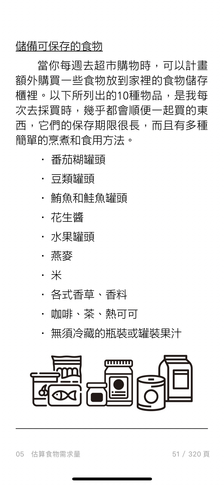
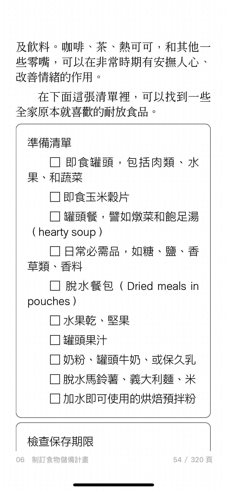
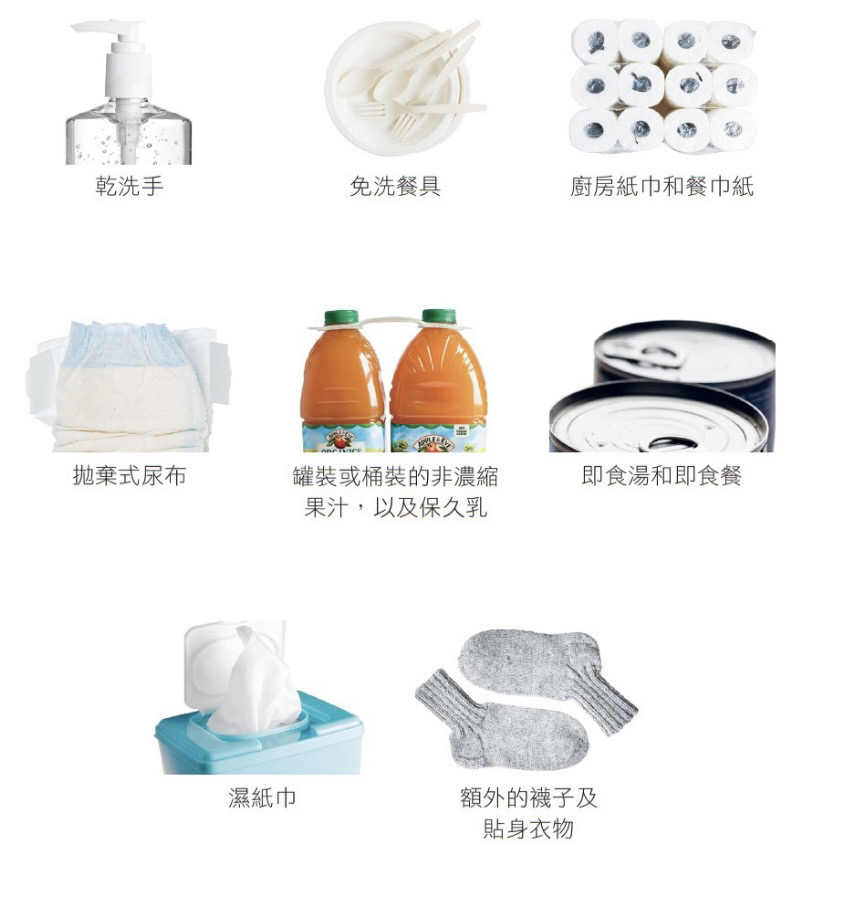

date:: [[Sep 18th, 2022]]
type:: #task-note
name:: 地震來了怎麼辦？
tags::  每日推進
related::
public:: true

- ## TODOs
  collapsed:: true
	- {{query (and (todo todo doing later) (page [[地震來了怎麼辦]]))}}
	-
- ## 下一步行動
	- ### 食物準備：背包內先一週戰備食品（放在包包）
	  background-color:: #497d46
	  id:: 632a5910-4229-41e2-b551-e1f72954801c
	  collapsed:: true
		- 7包錠+肉罐頭或肉乾（比較好，因為蛋白粉要泡開）
		- 罐頭
			- 欣欣牛肉罐頭*4
		- 戰備口糧
			- [Katadyn NRG-5 德國軍糧 美國軍糧戰爭儲糧 末日儲備 緊急食品 壓縮乾糧 餅乾 MRE口糧 災難 露營 探險](https://shopee.tw/product/57371944/10976800001?smtt=0.137974-1663636078.9)
				- 蛋白質有74克
		- 
		- 
	- ### 準備水資源，飲用水 50 L，生活用水 380 L
	  background-color:: #533e7d
	  id:: 632a5910-0f8b-4929-bfa5-8cbd22623c3a
		- 飲用水3天份： 50 L 多準備兩人份 + 咪估 (45L＋ 0.5*3 = 1.5 L)
			- 我發現超棒的東西『【OZOO 有物森林】【MIT】戶外折疊式水箱 20L 10L 5L三種規格 儲水攜帶式手提折疊水桶軟式水桶攜帶式野炊』，售價$85 - $250！分享給你 https://shopee.tw/product/90534964/9293002749?smtt=0.137974-1663717933.9
		- TODO 購買151-1136L得儲水桶
			- 380L才放得進我們的浴室
			- [快來看看『STYLE格調 ｜高密度PVC摺疊儲水桶【WAT-001】儲水桶 水桶 儲物桶 儲水 【現貨供應】』，現在打7.2折只要$1,350！快上蝦皮購物購買吧！](https://shopee.tw/product/150247890/15922229468?smtt=0.137974-1663705825.9)
		- 可以節省水資源的物品
			- 
	- ### 評估照明需求
	  background-color:: #793e3e
	  id:: 632a5910-d325-452b-89ea-88c99c41f441
	  collapsed:: true
		- TODO 可充電式戰術手電筒：[WUBEN 強光手電筒](https://shopee.tw/%E3%80%90%E9%8C%B8%E7%89%B9%E5%85%89%E9%9B%BB%E3%80%91WUBEN-C3-%E5%BC%B7%E5%85%89LED%E6%88%B0%E8%A1%93%E6%89%8B%E9%9B%BB%E7%AD%92-1200%E6%B5%81%E6%98%8E-18650%E9%8B%B0%E9%9B%BB%E6%B1%A0-USB-C%E5%85%85%E9%9B%BB-%E8%AD%A6%E7%94%A8%E8%BB%8D%E7%94%A8-EC20-i.2175286.6834637040?sp_atk=80a6ba57-d660-4063-a5ef-f58771d6f5dd&xptdk=80a6ba57-d660-4063-a5ef-f58771d6f5dd)
		- LED頭戴式頭燈
	- ### 準備防災資料夾
	  background-color:: #787f97
	  id:: 632a5910-22e0-4648-a8ea-810d943e74a2
		- 準備資料夾，可以放各種文本
		- 裡面要放
			- 個人資料
				- TODO 出生證明
				- TODO 駕照
				- TODO 疫苗紀錄
				- TODO 結婚證書
				- TODO 護照
				- TODO 身分證
			- 房屋資料
				- TODO 房屋契約
				- TODO 所有權狀
				- TODO 家裡鑰匙
			- 財務資料（密封信封）
				- TODO 銀行帳戶及其提款密碼
				- TODO 信用卡資料副本
				- TODO 去年的繳稅紀錄
			- 聯絡資訊
				- TODO 準備記事本
				- 聯絡資訊包含
				  collapsed:: true
					- 重要的電話
					- 電子郵件
					- 郵寄地址
					- 包含
						- 家人朋友
						- 保險公司
						- 醫生
						- 緊急電話
						- 緊急寵物收容所
						- 獸醫電話
	- 車子內的準備
		- 包包
			- 濾水瓶
				-
			- 不易腐壞的食物
				- 水果乾
				- 煎粿
				- 穀物棒
			- 手電筒
			- 備胎
			- 紙本地圖
			- 急救箱、藥品
			- 火柴
			- 手機充電器
			- 健走鞋
			- 反光故障標誌
			- 尋求救援標誌
			- 一包衛生紙
			- 空的汽油桶
			- 幾個塑膠垃圾袋
			- 汽車維修工具
			  collapsed:: true
				- 電池救援線
				- 維修膠帶
				- 管夾(hose repair clamps)
			- 書或掌上遊戲機
			-
- ## 為誰為何而做?
	- 誰的需求？
	- 要達成目的
- ## 如何量化成果？
	- ((632a5910-22e0-4648-a8ea-810d943e74a2))
	- ((632a5910-d325-452b-89ea-88c99c41f441))
	- ((632a5910-0f8b-4929-bfa5-8cbd22623c3a))
	- ((632a5910-4229-41e2-b551-e1f72954801c))
	-
- ## 有何阻礙限制？
	- 準備的阻礙
	- 執行的阻礙
	- 結案的阻礙
-