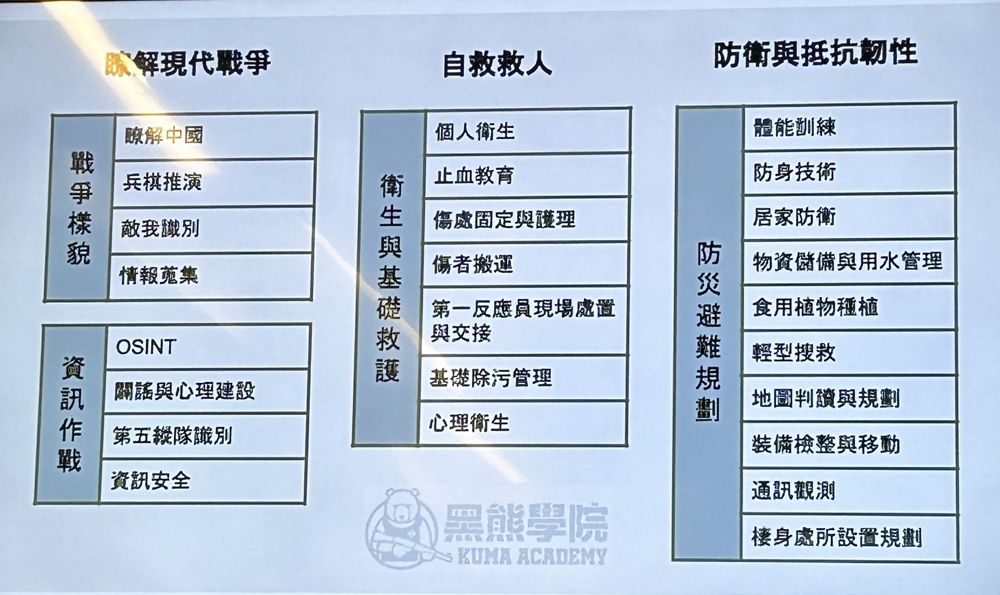
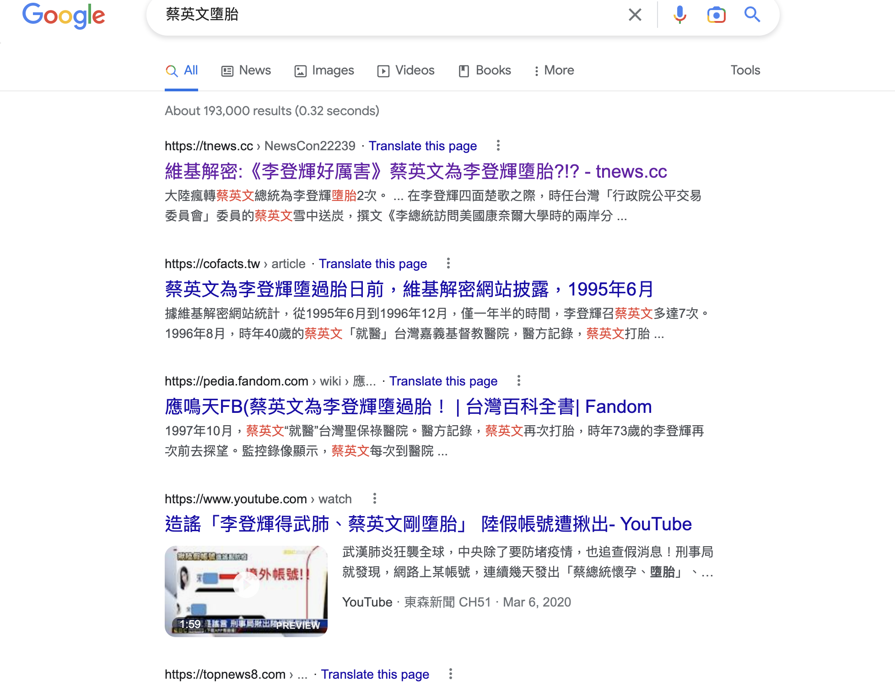

public:: true
date:: [[Nov 5th, 2022]]
type:: #task-note
name:: 戰爭來了怎麼辦
tags::
related::

## TODOs
collapsed:: true
	- {{query (and (todo todo doing later) (page [[戰爭來了怎麼辦]]))}}
	-
-
## Next actions
	- ### 黑熊學院：基礎營 {{renderer :wordcount_rxti}}
	  background-color:: gray
		- 發展方向
			- 1月有大型演訓活動，帶著背包一起一整天
			- 進階課程
				- 
				- 對資訊作戰與防災避難規劃有興趣
			- 線上課程：準備中
		- 戰爭是什麼？
		  collapsed:: true
			- > 意志間的較量
			- 有不同樣貌，認知、資訊、心理戰
			- 政治的延伸
			- 戰爭是組織性且有目的的集體行動
			  id:: 6365bfc9-db13-4224-8afb-b6cf9326329e
			- 背後的政治意圖
				- 中國：中華民族偉大復興
					- 還是他們只是為了維穩，而喊出這口號？
		- 目前台海現況
		  collapsed:: true
			- 有什麼優勢？
				- 地緣政治的地位
				  collapsed:: true
					- 台灣在第一島鏈，可以控制兩個航道
					  collapsed:: true
						- 
							- 資料來源： [wiki](https://zh.m.wikipedia.org/zh-tw/%E7%AC%AC%E4%B8%80%E5%B3%B6%E9%8F%88)
						- 陸權國家要跟海權國家爭霸的第一步
					- 巴士海峽
						- 東海艦隊、南海艦隊進入大洋地區的主要航道
						- 淺水區-->深水區的關鍵地區
				- 水下的重要性：深水區
				  collapsed:: true
					- 核子武器的發射，需要深水區
					- 空中發射飛彈容易被衛星偵測到
					- 
						- 資料來源：[自由時報](https://news.ltn.com.tw/news/life/breakingnews/3738334)
					- 中國目前想要積極進入南海，這樣可以躲避水下監聽陣列，與美國交戰更有利
				- 印太區域的價值
				  collapsed:: true
					- 
						- [reference](https://www.insightsonindia.com/2019/07/01/indo-pacific-regional-dialogue-2/)
					- 人口
					- 貿易夥伴
					- 區域安全條約
					- 30 超大型城市 ([Megacities](https://en.wikipedia.org/wiki/Megacity))
						- 人口超過 1000 萬的城市
				- 台灣海峽
				  collapsed:: true
					- 
						- [reference](https://www.bloomberg.com/news/articles/2022-08-02/taiwan-tensions-raise-risks-in-one-of-busiest-shipping-lanes)
					- 88%的各類船運航班要經過此地
				- 3C 產品的供應鍊
					- 晶片
			- 有什麼劣勢？
		- 如何識別敵我
			- 解放軍
			  collapsed:: true
				- 
					- [reference](https://chaoglobal.wordpress.com/2014/12/11/army-13/)
			- [中華民國國軍 vs 中國解放軍](https://youtu.be/6T75U2FhLm0?t=412)
		- Case study: 烏克蘭戰爭，以弱擊強
		  collapsed:: true
			- [刺針飛彈打下巡弋飛彈](https://news.ltn.com.tw/news/world/breakingnews/4086991)
			- [標槍飛彈](https://www.storm.mg/article/4324458?page=1)
			- [烏克蘭擊沈莫斯科號](https://news.ltn.com.tw/news/world/breakingnews/3902239)
			- 技術支援：電子偵查
			  collapsed:: true
				- {:height 446, :width 656}
					- [reference](https://news.ltn.com.tw/news/world/breakingnews/3882440)
		- ### 資訊作戰概論: Puma 沈伯洋
		  collapsed:: true
			- 進階營可以學到
				- [OSINT](https://ithelp.ithome.com.tw/m/articles/10288101)操作
					- DOING [[Day 3] 威脅情資概述 - OSINT 工具](https://ithelp.ithome.com.tw/articles/10288509)
					  :LOGBOOK:
					  CLOCK: [2022-11-05 Sat 15:30:55]
					  :END:
					- 公開情報操作
					- 假消息要怎麼分辨真假
				- 如何闢謠
					- 闢謠組織
				- 統戰網絡
					- 會不會有人倒戈？約 30 萬人有被統戰部接觸
						- 了解這些人的風險有多高，不要把關鍵事物交給對方
			- 平時
				- 作戰順序
					- 打破信任：散播陰謀論
					  id:: 6365da1d-c7ff-4e96-992a-b656d1ad5abf
					  collapsed:: true
						- 中國製造的陰謀論
						- 大外宣不是認知作戰
							- 目標對象是全球華人，而不是只有台灣人
						- 1個議題選在特定族群傳播（10%的人口）
							- 謠言散播越廣，他的作用越容易被中和掉
							- 謠言會丟其他國家有多爛（美國、日本），會開始覺得中國沒那麼糟糕
							- 親中反美言論，也會由教授傳遞
							- 在台灣的受害者是誰？
							  collapsed:: true
								- 了解受害者是誰，才能去協助他們
								- 中國目標：一代一線
								  collapsed:: true
									- 基層一線：村里長
									- 一代：20~29歲
								- 20~29歲
								- 為什麼不是長輩？
									- 長輩傳訊息時，自己也沒在看內容，對於內容的相信分數沒那麼高
					- 管道建立：線上與線下
						- 資訊流
						  collapsed:: true
							- 內容農場：柬埔寨、馬來西亞、越南的帳號丟到台灣
						- 金流
							- 交給別人製造、別人散播
							- 直播主抖內
							- youtube 帳號洗白，但同時有 tiktok 或是中國平台的帳號
							- #+BEGIN_IMPORTANT
							  需要有法令調查金流
							  #+END_IMPORTANT
						- 人流
							- [村里長很重要，要注意](https://news.ltn.com.tw/news/politics/breakingnews/4029474)
								- 代理人法案：中間人
						- 統戰網絡揭露
						- 爆料式社團，很多是中國或黑道經營
						- [中國人創的後援會](https://watchout.tw/reports/wn0UIuKmU9AYA3VRWJax)
						  collapsed:: true
							- 蔡英文後援會
							- 賴清德後援會
								- 創辦人：趣味動物事件
					- 個資蒐集
					  collapsed:: true
						- 狗或貓
						- 算命
					- 軟性陰謀論
						- 假消息已經是陰謀論的末端了
						- 會不斷給你細節
						- [希拉蕊是複製人](https://news.ltn.com.tw/news/politics/breakingnews/2767104)
						- 蔡英文墮胎
						  collapsed:: true
							- 
							- 最早以前的謠言是蔡英文會毀掉中華民國
						- 台灣疫情三級警戒
						  collapsed:: true
							- 900 多個帳號散播台灣疫苗全部都有問題，只有科興沒問題
							- 8 個 youtube 的頻道，已經被 google 刪除，[上季刪除上萬個中國頻道](https://unwire.hk/2022/10/29/google-terminates-over-10000-youtube-channels-linked-to-china/fun-tech/)
					- 反串製造紛爭
						- 不應該從內容判斷，要從行為模式判斷
				- 應對順序
					- 建立信任
						- 多參加實體活動
					- 識別管道
						- 預警身邊的人
					- 預示統戰網路
						- 誰是代理人
					- 預示陰謀論
					- 保護資安
			- 開戰前：平戰轉換
				- 作戰順序
					- 駭客攻擊
					  collapsed:: true
						- 大量蒐集個資
						  collapsed:: true
							- [2300萬個資外洩](https://www.cw.com.tw/article/5123412)
						- 破壞基礎設施
						- 裴洛西來台，[台鐵螢幕, 711 駭入](https://tw.news.yahoo.com/7-11-%E5%8F%B0%E9%90%B5%E8%A2%AB%E9%A7%AD-%E5%87%BA%E7%8F%BE%E8%81%B3%E5%8B%95%E6%A8%99%E8%AA%9E-%E5%88%91%E4%BA%8B%E5%B1%80%E5%87%BA%E6%89%8B%E4%BA%86-051400835.html)
						- [DDoS 攻擊](https://tw.stock.yahoo.com/news/%E9%A7%AD%E5%AE%A2%E6%94%BB%E6%93%8A%E4%B8%8D%E6%96%B7-%E5%A4%96%E4%BA%A4%E9%83%A8-%E5%9C%8B%E9%98%B2%E9%83%A8%E5%AE%98%E7%B6%B2%E5%87%8C%E6%99%A8-%E5%BA%A6%E7%99%B1%E7%98%93-%E9%AB%98%E5%B8%82%E7%92%B0%E4%BF%9D%E5%B1%80%E7%B6%B2%E7%AB%99%E9%81%AD-023500390.html)
							- 5000 多台路由器攻擊
					- 世界輿論鋪陳 (120%)
					  collapsed:: true
						- 中國在國外散播訊息、內容有沒有做改變，一起注意，有的話就是有危機的開始
				- 應對順序
				  collapsed:: true
					- 駭客攻擊
					- 假帳號、假粉妝
					- Deepfake
					- 公布情報
					- OSINT
					- 海外協助
			- 戰時
				- 作戰順序
				  collapsed:: true
					- 投降一定是假消息
					- 由專業團體戰爭消息闢謠
				- 應對順序
					- 不要投降
					- 不要驚慌
					- 不要揭露位置
					- 協助闢謠
			- TODO 回家功課
			  collapsed:: true
				- [練習陰謀論](https://fight-dis.info/tw/)
				- 學習回報訊息
					- [Mygopen](https://www.mygopen.com/)
					- [Cofacts](https://en.cofacts.tw/)
					- [TFC](https://tfc-taiwan.org.tw/)
				- [了解自我資安問題](https://haveibeenpwned.com/)
				- 加強軍事基礎知識
					- 阿共打來怎麼辦
				- 了解中國滲透
					- [China Index](https://china-index.io/)
				- 加入協助行列
					- [假新聞清潔劑](https://www.fakenewscleaner.tw/)
					- [對話千層派](https://www.facebook.com/ChatforTaiwan/)
			- 怎麼參與資訊作戰的準備？
			  collapsed:: true
				- 烏克蘭戰爭中，群眾情報作為
					- 利用現代科技：手機、網路
					- 「打卡」成為情報蒐集手法
						- 俄羅斯軍隊就儘量拍
						- 烏克蘭設施、人員與裝備都不要拍
					- 社群網站進行資訊戰、認知戰與情報戰
					- 心理戰
			- 要怎麼讓親中或是沒有戰爭意識的家人，了解現況？
			- 闢除軍事謠言
			  collapsed:: true
				- #+BEGIN_CAUTION
				  三分假七分真
				  #+END_CAUTION
				- 希望你棄械投降、開城迎敵
				  collapsed:: true
					- 首戰及終戰
					- 24小時就解放台灣
					- 留島不留人
					- 千枚飛彈血洗台灣
					- 早上打台灣，下午渡台，晚上一起看新聞聯播，隔天一起做核酸檢測
				- 推薦書籍：[阿共打來了怎麼辦](https://www.books.com.tw/products/0010911397)
				- 解放軍隨時會攻台
				  collapsed:: true
					- 現代戰爭很難突然發生，會有徵候
					- 軍演是入侵者要入侵時的掩護工作
					- 怎麼區別軍演與戰爭？
						- 部署軍隊不像在部署軍演
						- 開設野戰醫院
						- 運送物資有裹屍袋
						- 大軍未動糧草先行
						- ((6365bfc9-db13-4224-8afb-b6cf9326329e))
				- 金馬駐軍減少是棄守
				  collapsed:: true
					- 金馬沒有棄守，而是因為戰爭現代化演變而成，過多人部署在那邊，反而會變人質
				- 飛越台海中線就打下來
				  collapsed:: true
					- 
						- [reference](https://www.cna.com.tw/news/firstnews/201907300060.aspx)
					- [中國國防部不承認中線存在](https://voicettank.org/single-post/2020/09/30/093002/)
					- 西南空演
					  collapsed:: true
						- 
							- [reference](https://voicettank.org/single-post/2020/09/30/093002/)
					- 防空識別區
					  collapsed:: true
						- 
							- [reference](https://forum.ettoday.net/news/1808373)
				- 千枚飛彈炸爛台灣
				  collapsed:: true
					- 洲際飛彈要飛來台灣，預估 4000 萬(古老版本)~ 6~7億的價格
					- 航母殺手，10億美金
					- 打的話會打政軍目標，67個
					- 洲際飛彈
						- 
							- [reference](https://fas.org/blogs/security/2019/05/chinareport2019/)
				- 200 萬大軍，渡海擋不住
				  collapsed:: true
					- 台灣人力不足，打不過中國
					  collapsed:: true
						- 國共內戰意識的延伸，現代戰爭已經不是這樣發生了
					- 台灣軍人：22 萬
					- 渡海攻擊困難
					  collapsed:: true
						- 2020 年有一次符合適合登陸的海象
						- 海象要平穩，台灣海峽一年只有兩個月適合登陸，上半年與上半年
						- 潮汐，登陸時最好是高潮，退的時最好是退潮
							- 登陸時，最好是凌晨3~4點
							- 退潮時，最好是 6~7點
					- 14 個適合登陸地點
					  id:: 6365ce00-1fe2-4d0a-a6ff-3115915aa9b5
					  collapsed:: true
						- 
							- [reference](https://new7.storm.mg/article/3853105)
					- 反艦飛彈：[雄三](https://zh.wikipedia.org/wiki/%E9%9B%84%E9%A2%A8%E4%B8%89%E5%9E%8B%E5%8F%8D%E8%89%A6%E9%A3%9B%E5%BD%88)
						- 超音速飛彈射程最大 400KM
				- collapsed:: true
				  > 政府浪費錢買軍購
					- 軍購
						- [標槍飛彈](https://zh.wikipedia.org/wiki/FGM-148%E6%A8%99%E6%A7%8D%E9%A3%9B%E5%BD%88)
						- 無人機
						- 海馬斯火箭
						- 陸軍戰術飛彈
							- [ATACMS](https://en.wikipedia.org/wiki/MGM-140_ATACMS)
					- F16 戰機是垃圾
				- 中國有自己的軍備戰機，很強大
				  collapsed:: true
					- 中國戰機 [轟 6](https://zh.wikipedia.org/zh-tw/%E8%BD%B0-6), 1960 年後的產物
					- [中國戰機整理](https://zh.wikipedia.org/zh-tw/%E4%B8%AD%E5%8D%8E%E4%BA%BA%E6%B0%91%E5%85%B1%E5%92%8C%E5%9B%BD%E4%BA%A7%E8%88%AA%E7%A9%BA%E5%99%A8%E5%88%97%E8%A1%A8)
		- ### 基礎救護止血課程
		  collapsed:: true
			- 安全評估與通報
				- 自身安全為先
				- 通報法則 METHANE
				  collapsed:: true
					- 單位稱呼、事件
					- 地點
					- 事件型態
					- 有危險物質嗎？
					- 到達現場動線
					- 受傷人數與型態
					- 需要的資源
				- 三階段區域觀念
				  collapsed:: true
					- 熱區：直接威脅
					- 暖區：間接威脅
					- 冷區：後撤安全
			- 止血觀念與技術
			  collapsed:: true
				- 時間就是性命
				- 失血量
				  collapsed:: true
					- 57 KG * 0.07 = 4.07 KG 血量 = 4070 c.c.血量
					- 4 成出血就會致命
				- 動脈出血
				  collapsed:: true
					- 出血性休克
				- 創傷死亡三角
				- 止血步驟 ABC
					- 119 (Alert 911)
					- 找出血 (Bleeding)
						- 不要只看到最大的傷口
						- 衣服下可能有其他致命出血
						- [動脈傷到以後，出血速度很快](https://www.youtube.com/watch?v=JfL16vUwIrs)
					- 壓迫止血 (Compress)
						- 直接加壓
							- 不要拿衛生紙，會糊掉，黏在傷口上
							- 紗布、毛巾或衣服
							- [stop the bleed](https://www.youtube.com/watch?v=mhBe7Q6mH3U&ab_channel=UCSanDiegoHealth)
							- 用全身重量去壓
						- 動脈出血：傷口填塞
							- 建議使用在認識的人或親人身上就好
								- 因為是侵入性治療
							- 不能使用止血帶的位置，使用傷口填塞
							  id:: 6365f690-b72e-4b73-9790-eca106fb8126
								- 軀幹
								- 頸部
								- 交界點
							- 使用紗布卷
							- 手塞進去後，手指不要離開，一直塞紗布進去，直到傷口滿了
							- 再加壓
						- 止血帶
						  collapsed:: true
							- CAT
							- 黑色：軍人用
							- 橘色：警方或平民
							- 藍色：練習用
							- 止血帶會造成疼痛，不要心軟
							- 綁止血帶，無法送血進去的肢體可以無氧進行運作 4~6 小時
								- 但超過了也不要拿下來
								- 要手還是要命？
						- 彈性繃帶包紮
							- 也可以使用在不能使用止血帶的位置
							- 頭部
								- 使用三角巾，不會使用彈性繃帶
							- 頸動脈
								- 從腋下繞
								- 用綁的固定，不要用塞的，因為是加壓拉緊
							- 定帶
								- 尖端向前
								- 三角往下折
								- 下一次壓在三角折下處
							- 環狀
							- 螺旋
		- ### 要為戰爭做的準備：避難準備規劃工作坊
			- #+BEGIN_PRIVATE
			- 5分鐘認識大家
			  collapsed:: true
				- Jessica
					- O
					- 溝通能力
				- Evena
					- O
					- 壯壯
					- 組織規劃
				- Johnny
					- AB
					- 硬體工程師
				- HK
					- B
					- 擅長軍事相關的
					- 工程師
				- 周大森
					- A
					- 退休，花圃
			- #+END_PRIVATE
			- 戰時管制
			  collapsed:: true
				- 物資控管：里長發放物資
				- 人員移動：宵禁、交通管制
				- 人力動員：動員軍需生產、醫療救護及消防勤務單位
			- 空襲警報
				- 避難地點
					- 住家、工作地點附近的地下室、車站、車內
				- 遠離窗戶
					- 尋找遮蔽
					- 迅速趴下
					  collapsed:: true
						- 
							- [reference](https://www.google.com/url?sa=i&url=https%3A%2F%2Fwww.youtube.com%2Fwatch%3Fv%3DQrsnPNE3Ju8&psig=AOvVaw3gG3FqlvovwDMPtYsbqYB4&ust=1667721187162000&source=images&cd=vfe&ved=0CA4QjhxqFwoTCIDa6-bHlvsCFQAAAAAdAAAAABAD)
			- 收容所開設
				- [防災士培訓課程](https://pdmcb.nfa.gov.tw/dp/training-institution)
			- 家庭避難計畫
				- 去哪裡逃難
					- 防空避難所
					- [警政服務app](https://apps.apple.com/tw/app/%E8%AD%A6%E6%94%BF%E6%9C%8D%E5%8B%99/id544121843)
					- 找不到地方的話： The rule of 2 walls
					- 危險地區： ((6365ce00-1fe2-4d0a-a6ff-3115915aa9b5))
					- 安全地區：中彰投
				- 約定緊急會面點
				  collapsed:: true
					- 明確、容易到達、人人皆熟悉的地點
						- 公園、學校、親戚家
					- 離開家前往避難處
						- 地點：學校、運動中心
				- 心理準備
					- 注意身心狀況
				- #### 物資準備
					- related:: [[地震來了怎麼辦]]
					- 在家時
					  collapsed:: true
						- 食物
							- 長期儲放食物櫃
								- 全家2~3週食物量，定期更新
								- 種植蔬果
						- 飲水
							- 大型儲水袋
						- 能源
							- 太陽能板
							- 大容量充電站
							- 蠟燭
							- 電池
					- 離家時
					  collapsed:: true
						- Every Day Carry (EDC)：供給幾小時
							- 常用工具
						- Get Home Bag (GHB): 供給 1 個晚上
							- 不得出門時
							- EDC + 水、飲食、衛生用品
						- Bug Out Bag (BOB)：供給 2~3個晚上
							- 撤離、轉移時
						- 外出準備
							- 飲食
								- 基本
									- 水
									- 肉乾
									- 堅果
									- 軍用口糧
									- 罐頭
									- 巧克力
									- 鹽巴
									- 寵物食品
									- 免洗餐具
								- 增加攜帶
									- 淨水器/錠
									- 電解水
									- 嬰兒食品
								- 有的話很好
									- 酒精
							- 保暖
							  collapsed:: true
								- 基本
									- 衣物
									- 雨衣
									- 保暖毯
									- 毛巾
								- 增加攜帶
									- 防風外套
								- 有的話很好
									- 暖暖包
									-
							- 資訊
							  collapsed:: true
								- 基本
									- 手機
									- 行動電源
									- 電池
									- 收音機
								- 有的話很好
									- 小型太陽能發電機
							- 醫療
							  collapsed:: true
								- 基本
									- 藥品
										- 腸胃
										- 感冒
										- 止痛
										- 退燒
									- 急救用品
										- ok棒
										- 優碘
										- 止血帶
									- 口罩
								-
							- 工具
							  collapsed:: true
								- 基本
									- 打火石、打火機
									- 瑞士刀
									- 電池、行動電源
								- 增加攜帶
									- 摺疊安全帽
									- 乾洗手（省水用）
							- 個人
							  collapsed:: true
								- 基本
									- 手套
									- 護目鏡
									- 衛生紙
									- 濕紙巾
									- 個人資料
									- 家人相片
									- 衛生棉
						-
				- #### 生活鄰近的防空避難所（近到遠）
					- 住家附近
				- 遇到軍隊怎麼辦
					- 敵軍：迴避、可拍就拍
					- 我軍：給予支持、不要拍照
				- 看到武器在地上，要撿嗎？
					- 不要動他
				- #### 家庭避難準備（北部）
					- 計畫相關人
						- 寵物
						- 另一半
					- 戰時狀態
						- 家人醫療人員*1
					- 約定會面地點
						- 門口警察局
						- XX 15
						- XX 捷運站
					- 轉移的避難點
						- 附近親戚家
						- 捷運站內部
						- 中部老家
					- 儲水計畫 7 天，多準備，共 4 人
						- 淨水工具
							- 淨水吸管（個人隨身濾水）
							- 攜帶水壺+濾水芯
						- 飲用水多準備一些以防萬一：42L，寵物飲水 1.5 L，可以買 50L 的飲用水桶
							- 1500 c.c. * 4 人 * 7 ~= 42L
						- 生活用水，大型儲水桶：380 L
					- 維生計畫: 2人 + 1 寵 ，7 天
						- 戰備口糧
						- 肉罐頭
						- 寵物糧食
	- ### 階段性成果 B: 現階段可完成、與我有關
	  background-color:: yellow
	-
## For whom and why?
	- Who need it?
	- Targets
## Measure the result
	- Time
	- Amount
	- Special
## Restrictions and obstacles
	- Preparation
	- Doing
	- Finished