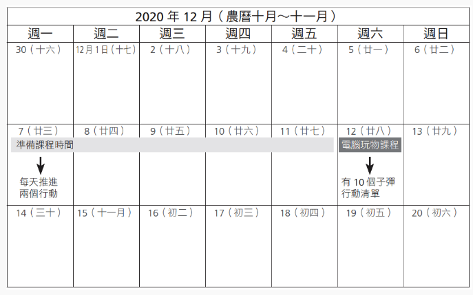
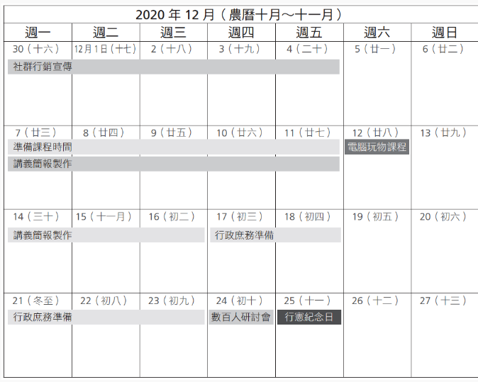
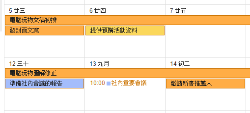

title:: 時間管理/時間管理的30道難題
public:: true

-
- name::  時間管理的30道難題
  author:: 
  type:: [[books]]
  rate:: ?/10
  tags::
  recommended_by::
  pdf::
-
- date:: [[Sep 8th, 2022]]
  type:: #task-note
  name:: 時間管理的30道難題
  tags:: 哪次不做
- #+BEGIN_PINNED
  時間管理是，在每一個當下的時間點，去做有價值目標，無論那是哪一個目標。
  
  3-1 看得見的拖延很有壓力？VS「覺察隱性拖延」
  #+END_PINNED
- ## TODOs
  collapsed:: true
	- {{query (and (todo todo doing later) (page [[時間管理的30道難題]]))}}
	-
- ## 下一步行動
	- ### 了解什麼是重要的-目標選擇
	  background-color:: gray
	  id:: 631953d8-231b-4e18-9cd4-d7230fb65006
	  collapsed:: true
		- 不要看別人完成就覺得很有價值，只有事情被我們充分完成時，才是真正有價值的
		- TODO 問自己，五次「想要的是什麼？」
			- > 我的目標，真的是我的目標嗎？我想要的是什麼？
			- [[Wanna/➡️  成為資深工程師]]
			  id:: 6319623a-9e73-42c2-8d0c-4bc8f7a16c69
			  collapsed:: true
			- [[Wanna/擁有好身材]]
			  id:: 63196246-c5f3-4f6c-93cf-7b25f5812140
			  collapsed:: true
			- [[Wanna/➡️  流利說英文]]
			  id:: 631964e5-e325-493b-bc0d-ed27bc16bd8f
			  collapsed:: true
		- TODO 反直覺地追問出，要做的事情的背後目的是什麼
		- 時間管理不應該是犧牲某樣東西，應該是怎麼安排時間，一步一步地讓我可以達成自己想要的目標
		- #### 年度目標-目標現實化表單
		  collapsed:: true
			- #### 收集腦中想法
				- 快樂的想法
				- 擔心的想法
				- 一直想到的想法
			- #### 具體願景
				- 要一直問自己背後真正想要的是什麼？
			- 列出可能要解決的問題與改變
				- 有什麼阻礙？
				- 要做什麼改變？
				- 寫下所有想到的問題
			- #### ➡️ 我的年度目標
			  collapsed:: true
				- ((6319623a-9e73-42c2-8d0c-4bc8f7a16c69))
				- ((63196246-c5f3-4f6c-93cf-7b25f5812140))
				- ((631964e5-e325-493b-bc0d-ed27bc16bd8f))
		- #### 不一定要做年度目標-問題成果法
		  collapsed:: true
			- 目標不是刻意找出來的，而是跟生活中要解決的問題有關
			- 為想法設定願景，為問題設計成果
		- #### 想做的目標有好多-專準選擇法
			- 比價：哪個願景更有價值？
				- ((6319623a-9e73-42c2-8d0c-4bc8f7a16c69)) > ((63196246-c5f3-4f6c-93cf-7b25f5812140)) > ((631964e5-e325-493b-bc0d-ed27bc16bd8f))
			- 淘汰：哪個下階段成果最能做得到？
				- ((63198252-b48b-4262-b0c7-73a8b0da39b5))
			- 串連：目標之間的願景是否相關？可以結合嗎？
				- ((6319a4d4-bc76-41aa-84f1-5852da4f0064))
		- #### 🗃 金字塔收集箱: 雜事收集箱
			- 1️⃣ 目標金字塔收集箱
				- 與目標有關的雜事，一定要做
			- 2️⃣ 一定要做的雜事收集箱
				- 他人希望我去做、我想做
			- 3️⃣ 其他雜事收集箱
				- 不是非做不可的事情，也沒辦法放進目標系統當中
				- 其他人推薦某本書，很想買來看，看起來是有意義的事情沒錯，但是跟我目標無關
	- ### 安排計畫-沒有完美的計劃
	  background-color:: red
		- 完美計畫是由不完美計畫演變而成
		- 不完美計畫應該要先「解決問題」，讓計畫變完美
		- #### 排出更多空檔
		  id:: b468596b-3964-48fd-a1db-4ac41317a306
		  collapsed:: true
			- 想達成目標，不是要去大改變自己生活習慣，而是要將要做的事情，安插在自己原本的習慣之中
			- 有什麼阻礙？ 要做出什麼改變？
				- 不需要犧牲，而是要調整自己目前的做法
			- 時間空檔計算
				- 一週有 168 小時
					- 每天睡 8小時 (56 小時)
					- 每天工作 8 小時 (40 小時)
					- 每週 3 次健身 (4.5 小時)
					- 每天吃飯 1.5 小時 (10.5 小時)
					- TODO 統計煮飯花多少時間？
						- 每週煮飯四次， 1.5 小時 (6 小時)
					- 👉 每週我有: 51 小時
						- 包含通勤時間，也都要完全掌控
		- #### 事情永遠都不照計畫: 衝刺目標法
		  collapsed:: true
			- 看得見、可掌控的成果，才會更有動力
			- 追求完成事情，才能回頭修正目標
			- TODO 專注在下一個成果，==短期==內可獲得的具體成果
			- TODO 是否有其他各種可以達成成果的方法？
				- 計畫是否有其他替代備案？計畫訂太死反而更容易半途而廢
		- #### 零碎時間的運用：「子彈情境法」
			- 懂得切割行動，是否可以回推、切割更小的行動？
			- 不同的情境下，可以採取什麼替代行動？
			- 例如：寫文章
				- 通勤時，想大綱、列出關鍵字、設計題目
				- 電腦前，根據大綱專心寫文章
			- [[晚上回家後，可以有更多時間可以學習]]
		- 思考有哪個階段性成果，是我目前可以去推進，並且具有我認同的價值
			- 不會一次就將計畫規劃好，而是先規劃出，我目前可以做到的「階段性成果」
	- ### 拖延症候群: 減少我拖延的次數
	  background-color:: pink
	  collapsed:: true
		- 拖延真正的問題，是我們去如何反應拖延的情緒
		- 不要逼自己不拖延，而是回顧自己的目標計畫，是不是給自己壓力過大的代辦清單？
		- 偶爾拖延一下也好
		- > 拖延是個訊號，在提醒我們人生中還有更重要的事情要去做
		- #### 隱性拖延
		  collapsed:: true
			- 為了推延這件事，其他什麼事情也不做
			- 自我懲罰的心結，一件事還沒有找到做法、好想法之前，不代表要用不做事懲罰自己，或是無法玩樂
			- TODO 當目標 A 拖延了，B 不能先做嗎？尋找可以替換先做的目標
		- #### 逃避目標瞎忙
			- 感覺什麼都不想做，或什麼都想做，不願意為自己下決定
			- 兩個層級
			  collapsed:: true
				- 拖延時，無目標打開影音社交網站，尋找有做事的感覺
				- 打開郵件、通訊軟體，讓其他人的選擇，使自己感到忙碌與安心
			- 雜事被拖延了，但我是否還有其他生活、工作上的想法，可以推進呢？
		- #### 解決方法：成果鼓勵法
		  collapsed:: true
			- 越重要的事情越會拖延？
			- 「看得到目的地」（有具體成果）的目標，才是不容易拖延的目標
			- 不確定性，也可以說是「自我懷疑」，會是拖延最大的元兇
			  collapsed:: true
				- 階段性成果範例
					- 這個禮拜寫完第一篇文章 --> 用一個禮拜的時間，先寫幾個最有把握主題的草稿，看看能推進到什麼程度
						- 降低不確定性，減少自我懷疑
			- 真正有效的鼓勵，是證明自己現階段可以完成一些成果，用這些成果推進自己朝向重要目標前進
			- 使用外在懲罰去克服拖延呢？
			  collapsed:: true
				- 初期都會有效果，如果沒有建立內在驅動力，這效果會遞減，進而就需要更大的懲罰去驅動，結果適得其反
			- 階段性成果必須「和我有關」
				- 也就是「我所認同的價值」，與我喜不喜歡無關
					- 工作上的重要專案
					- 他人給我的重要任務
				- 別人外加給我的重要任務，如何加上「我認同的價值」呢
			- 困難的任務：拆解下一步行動
			  collapsed:: true
				- 立即可完成的行動，才能執行
					- 回推法：第一個步驟是什麼？
					- 切割法：由多個簡單步驟行程困難成果
					- 替代法：困難任務不會只有疑塚實現方法
					-
			- 子彈行動清單
				- 目標具體願景
				- 目標階段性成果
					- 現在可以做得到的成果
					- 我所認同價值的成果
				- 回推前一部準備動作
				- 切割每一個小成果行動
				- 替代可選擇的行動
		- #### 卡關可以用「積極休息法」
			- 莫法特的休息方法：切換不同工作
			- 卡關時或壓力大時，推進另一個目標，重建信心
				- 也可以是看有深度的電影、有強度的運動
	- ### 規劃進攻型行事曆
	  background-color:: green
	  id:: 3604c598-7d43-48b8-b6a6-6083a8f15db2
		- [reference](https://www.playpcesor.com/2015/07/calendar-project.html)
		- [我在 Google 日曆上的專案管理思維：心得與方法分享](https://www.playpcesor.com/2015/07/calendar-project.html)
		- #### 如何安排預留時間？
		  collapsed:: true
			- 重要任務(D-day)
			- 設定階段性成果，將成果預留的時間，以進度條的方式畫在日曆上
				- 
					- 因為 D-day 的清單有 10 個步驟，畫上進度條，代表每天只需要推進兩個步驟
				- 根據自己的工作狀況，調配一天可以容納多少進度條，因人而異
					- Esor 通常一天最多會有四個進度條，約 7 小時的工作時間，留 1~2 小時空檔，作為 buffer
				- 
		- #### 好處
		  collapsed:: true
			- 知道什麼時候開始/結束
			- 避免自己作繭自縛
		- #### 神聖時間
		  collapsed:: true
			- 神聖時間可以是零碎時間，也可以是完整時間，他就是要用來做達成人生目標某步驟的時間
				- Esor 結婚前： 9~12 PM
				- Esor 生小孩前：5~7 AM
				- 生小孩後: 所有通勤與零碎時間（半小時～一小時）
			- 保留時間給有價值的事情，每天保留 1~2 小時的進度條，給某個重要目標的步驟
		- #### 顏色意涵
		  collapsed:: true
			- 我的方法是，我會區分三種顏色：長期計劃、臨時任務、重點關鍵，例如下圖中==橘色==是長期進度的進度條與截止日，也代表我的核心工作；而==黃色==則是代表這項核心工作裡又特別重要的重點關鍵。
			- 而==紫色==則代表臨時任務、次要瑣事。這樣的三個顏色區分，就能讓我一眼就辨別出應該關注的重點在哪裡。
			- 
		- DONE 將我的目標，規劃到我的進攻型行事曆上 [[Sep 11th, 2022]]
		  :LOGBOOK:
		  CLOCK: [2022-09-08 Thu 22:47:33]
		  CLOCK: [2022-09-11 Sun 22:49:07]--[2022-09-11 Sun 22:49:08] =>  00:00:01
		  :END:
		- DONE 安排下週行事曆
		  id:: 631df566-e9b8-4c0c-9822-7049752ad6b3
		  :LOGBOOK:
		  CLOCK: [2022-09-11 Sun 22:49:18]--[2022-09-11 Sun 22:49:24] =>  00:00:06
		  :END:
			- [[Sep 11th, 2022]]
				- 花了 1 小時半在安排，第一次安排花了比較多時間
				- 發現 [[Sep 16th, 2022]] 沒東西可以排進工作的進度推進，可能要再看是不是因為沒有卡片，還是我估時間的方法不對
		- #### 剩多少時間？效率數據化
		  collapsed:: true
			- 把工作量化成步驟
				- 比起一個龐大任務，任務拆分出步驟，更可以了解需要多少時間
			- 用計時器計算
				- 番茄時鐘或計時器去計算
				- 好處
					- 了解任務所需時間，作為進攻型行事曆安排預留時間的依據
					- 作為改善流程優化的依據
			-
	- ### 瞎忙：「三層代辦清單法」
	  background-color:: blue
		- 每天都很像是在
			- 忙別人的事情
			- 做了很多事情，卻都沒有滿意的成果
			- 越做越多，但卻越迷惘，自己到底想要什麼？
		- #### 三層代辦清單
			- 第一層：自我實現
			  background-color:: gray
				- > 你有什麼想要自我實踐的願景目標？ * 1 個行動
				- 自我實現的願景目標，通常沒辦法放在進攻型行事曆上，因為沒有明確的時間點。可以將目標拆解，放到每日代辦清單中
				- 可能是寫部落格文章、家庭育兒目標內的行動，甚至是想玩的遊戲（對你而言很重要的目標）
			- 第二層：進度推進
			  background-color:: gray
				- > 今日非做不可，最有價值的行動是什麼? * 最多 4~5 個行動
				- 利用進攻行事曆上的資訊判斷，要放哪些進來
				  collapsed:: true
					- 確定要參加的會議、活動
					- 有截止日期的目標專案
						- 階段性成果進度
				- 怎麼判斷重要性？
					- 不能用直覺判斷，要取決於這事情「是否在進度上」，利用進攻行事曆做輔助判斷
				- 每天最少要推進目標中的一個行動，列的越少越好，只列必要，做完了就回目標金字塔，挑選下一步要做的行動
			- 第三層：雜事處理
			  background-color:: gray
				- 先不要預先列事情，有時候會突然冒出一些「一定要做的雜事」，可以用額外時間處理
	- ### 反省日記：「KPT 覆盤」
	  id:: 631c8eb0-dfa3-494e-8a4d-3b99f30f7156
	  collapsed:: true
		- [[時間管理/防彈筆記法]]的話，就不需要刻意覆盤筆記，但 KPT 覆盤似乎是別種東西？
		- K (Keep): 問自己這一次目標拆解與行動清單，有哪些下次可以直接照著執行
		- P (Problem): 問自己這一次犯了什麼錯，遇到什麼問題？
		- T (Try): 下一次如何修改目標拆解、行動清單，來解決問題、避免犯錯
		- 步驟
			- 進行任務的過程中，有遇到任何問題、經驗，都整理回目標金字塔整理系統當中
			- 專案完成後，在原本已經拆解好的行動清單上調整
	- ### TODO 參加「電腦玩物Esor的時間管理哲學」
	  background-color:: purple
	  id:: 6319a8bd-b11e-495b-a351-0a013fa879af
		- course:: 時間管理哲學
		  link:: [報名網址](https://shop.darencademy.com/product/view/id/47)
		  price:: 4980
		  date:: [[Oct 1st, 2022]]
		- DONE 先閱讀[[時間管理/時間管理的30道難題]] ，了解進攻型行事曆後，再決定
		  :LOGBOOK:
		  CLOCK: [2022-09-08 Thu 00:13:17]--[2022-09-11 Sun 07:09:16] =>  78:55:59
		  :END:
			- 看完後，對時間管理又更深一層的了解，不過還是更想深入進攻型行事曆
			- DONE 購買「電腦玩物Esor的時間管理哲學」課程
			  id:: 631d191e-1f36-48a0-b54e-aca9881e26a6
		- TODO 帶我家裡的 防彈筆記法 給 #@Esor 簽名
		- #### 問題
			- id:: 631de17b-bdd8-4e2b-b970-09bceb591e05
			  >#@Esor 又拜讀了「時間管理的30道難題」，為了了解規劃進攻型行事曆的方法，我最後報名了 10/1 的時間管理課程 XD
			  在閱讀的過程中，有看到 [反省日記：「KPT 覆盤」](((631c8eb0-dfa3-494e-8a4d-3b99f30f7156))) 的覆盤步驟，但似乎可以用 [[時間管理/防彈筆記法]] 在執行期間，就進行覆盤修改的步驟，就可以達到一樣效果了？因此，想請問 [反省日記：「KPT 覆盤」](((631c8eb0-dfa3-494e-8a4d-3b99f30f7156)))  跟 [[時間管理/防彈筆記法]] 是否有什麼不同，還是其實是同個概念呢 ？
				- > #@Esor KPT講的是心法，防彈筆記中講的是他實踐的方式
			- > 進攻型行事曆，是在日曆上畫上「階段性成果」的進度條嗎？自己在執行時，會感受到似乎會與每週安排「每日行動清單」的動作有點重複，還是是因為我挑出來放在「每日行動清單」的任務，有時候是放「階段性成果」的標題呢？
			  ## 為誰為何而做?
			  ## 如何量化成果？
	- ((631953d8-231b-4e18-9cd4-d7230fb65006))
	- ((3604c598-7d43-48b8-b6a6-6083a8f15db2))
- ## 有何阻礙限制？