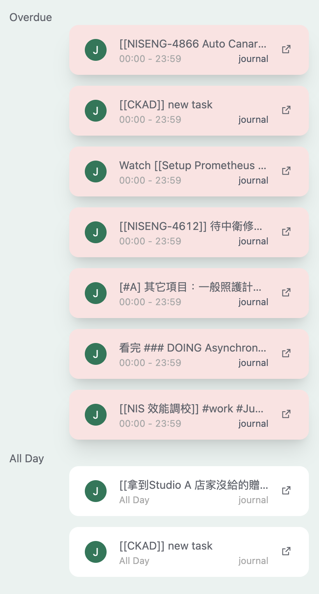
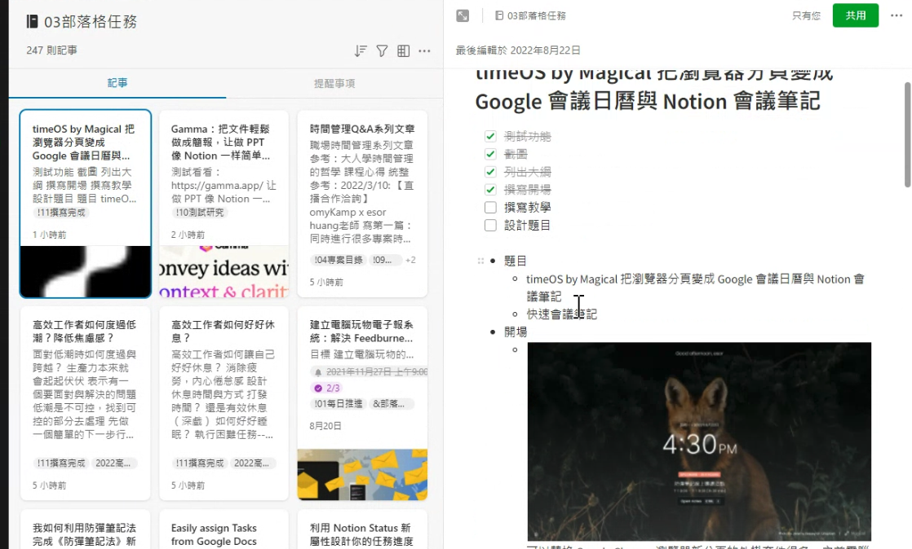
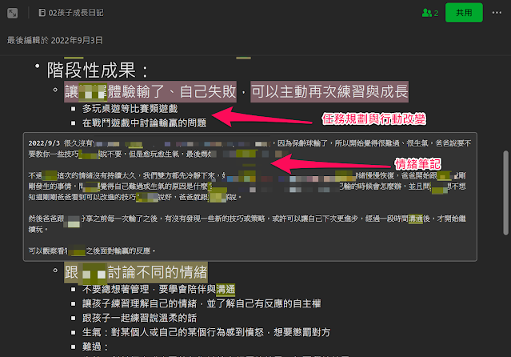
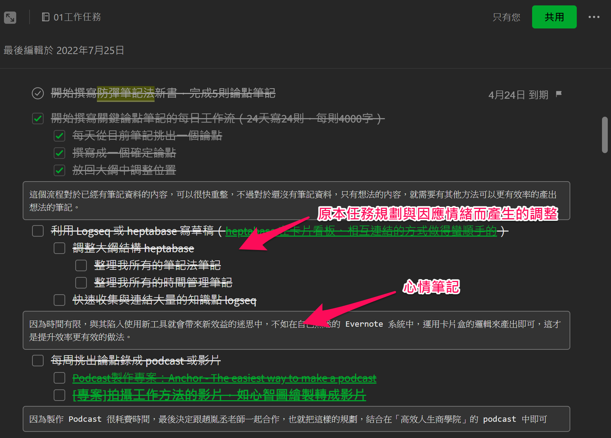
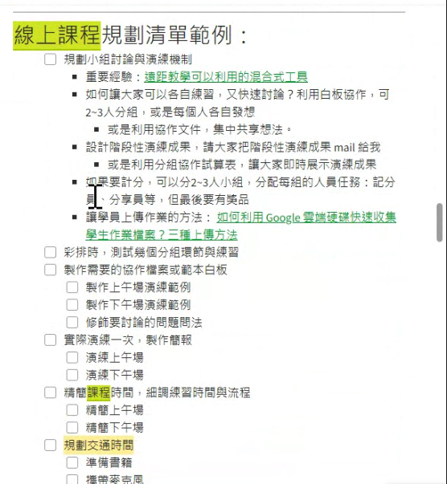
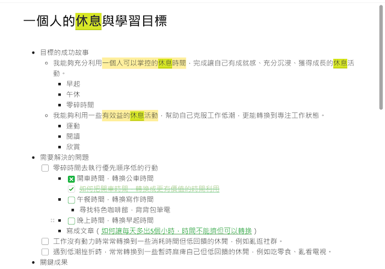
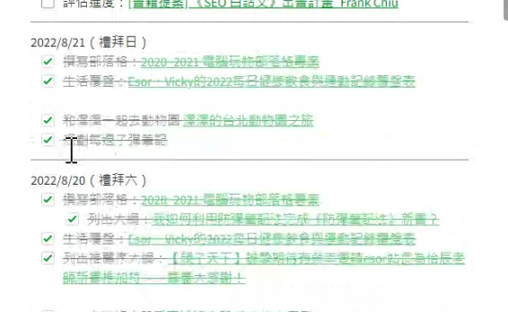
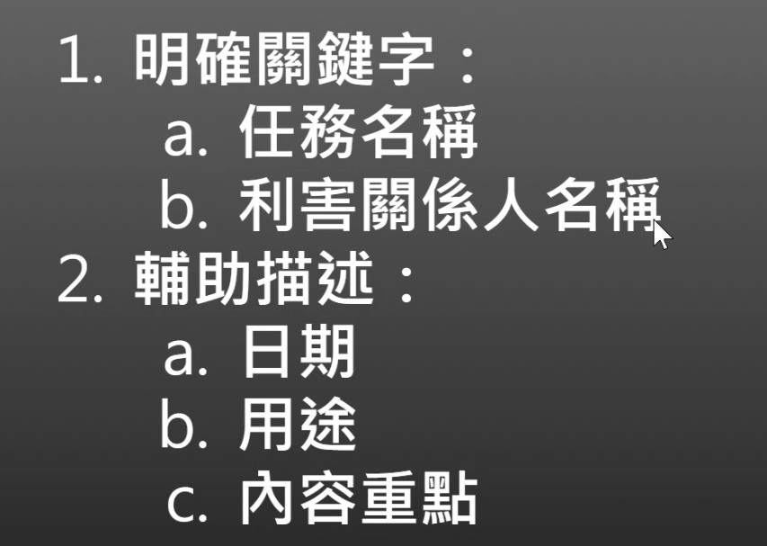
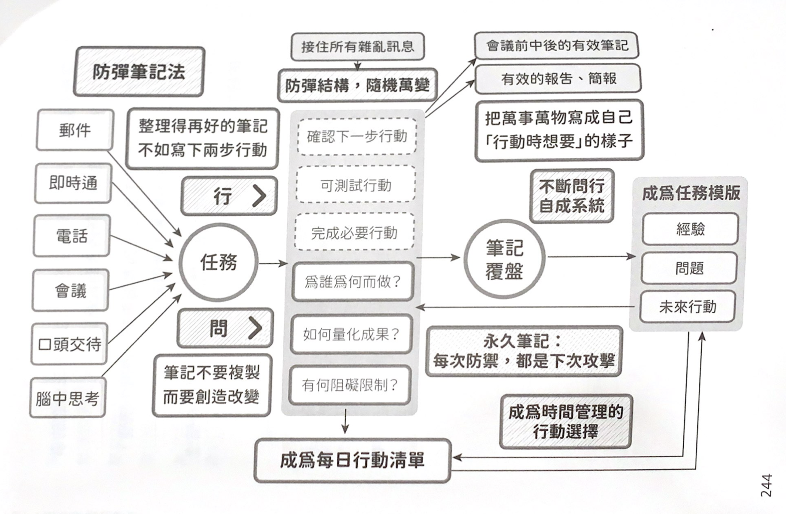

public:: true
name:: 防彈筆記法
author::
type:: [[books]]
rate:: ?/10
date:: [[Jul 23rd, 2022]]
title:: 時間管理/防彈筆記法
tags::  哪次不做
recommended_by::
pdf::

- #+BEGIN_IMPORTANT
  一個任務一個筆記、一個專案一則筆記
  #+END_IMPORTANT
	- 排出優先順序
	- 寫出下一步行動清單
- #+BEGIN_IMPORTANT
  從核心筆記出發，區分的不是資料，而是狀態 p.88
  #+END_IMPORTANT
	- **轉化**，而非紀錄
	- **覆盤**，而非計畫
	- **執行**，而非流水帳
- date:: [[Aug 23rd, 2022]]
  type:: #task-note
  name:: 防彈筆記法
  tags::
- ## TODOs
  collapsed:: true
  
  collapsed:: true
  
  collapsed:: true
	- {{query (and (todo todo doing later) (page [[防彈筆記法]]))}}
	-
- {{renderer :tocgen}}
- ## 下一步行動
	- ### 閱讀「防彈筆記法」
	  
	    id:: 6319a8bd-3be2-4750-ba3a-c8a2636a46c1
	    background-color:: gray
	- ### 參加讀書會
	  
	    background-color:: red
	    id:: 6319a8bd-cff3-43fa-b260-04a4adae93ed
		- #+BEGIN_PINNED
		    [[Aug 7th, 2022]] 20:00~21:30 讀書會
		    #@Esor 好像會有線上課程，要注意～
		    #+END_PINNED
		- ### [[Aug 22nd, 2022]] 20:00~21:30 第二次參加讀書會
	- ### DONE 參加線下課程「防彈筆記法：輕鬆打造讓大腦減壓的生產力系統」
	  
	    background-color:: green
	    id:: 6319a8bd-3f68-45a8-acbf-bcf9c6b43494
	    :LOGBOOK:
	    CLOCK: [2022-09-17 Sat 11:23:09]--[2022-09-17 Sat 18:46:29] =>  07:23:20
	    :END:
		- price:: NTD4900
		    date:: [[Sep 17th, 2022]] 09:00 - 17:00
		    link:: <https://ycctraining.com/course1?id=66>
		    pdf:: 
		    slide:: 
		- collapsed:: true
		    id:: 63303818-6678-4362-9bca-a5d0657ceb79
		    > 知識與經驗筆記（思考筆記）跟任務筆記有什麼差別？有沒有範本？像是防彈筆記法我看完了，有做了許多重點摘要筆記，但這些筆記並沒有被我納入再下一步行動內，比較像是 reference 放著而已，那這樣算是知識/思考筆記嗎？
			- 還是可以新增資料筆記，筆記前面還是可以有一些行動清單
				- 將資料筆記 reference 到你的任務筆記中
			- ((632559fa-f41f-40d5-a555-5a4ccedfe51f))
		- id:: 63303818-6f64-4d29-aa4c-04dcb7a7f4ba
		  collapsed:: true
		      collapsed:: true
		    collapsed:: true
		    > 如何設計好的空檔情境提醒
			- 每日行動情境
			- ((6325542e-6d9e-4872-859e-3cdb7f8679d5))
			- > 無法設定時間提醒的時候呢？
				- 搜尋可以找到，就不要設定標籤
				- 有件事情，有個時刻我要去做
				- 如何提醒優先順序？
					- 任務、專案需要的「進度」
						- #每日推進 ：每天都需要推進的任務
						- #企劃醞釀 ：還在醞釀的 idea 或是專案
						- #定期追蹤 ：已經結案
					- 一般進度、特殊進度
					- 選擇當下要執行的
						- 慾望清單
							- 想要 ：想要但不一定必要
							- 需要 ：需要買的東西
							- 滿足 ：買過的東西
				- 在你需要的情境、使用需求上，設定標籤
				    collapsed:: true
					- ❌ 例如：為餐廳評分
					- 好的標籤
						- xx 愛吃
						- 大日子
						- 小日子
						- 再吃推薦
						- 住家外食
						- 朋友一起吃
				- TODO 如何分類（沒抄到筆記）
				- 練習
					- 你想要管理什麼類型的任務？
						- [[Wanna/擁有好身材]]
						    id:: 632583cd-7ee5-43f4-8f3d-ad3540c34426
						- [[Wanna/成為資深工程師]]
						    id:: 632585d7-e8fe-46b8-af90-9187733f0cae
					- 認為這些任務有哪些執行進度？
						- ((632583cd-7ee5-43f4-8f3d-ad3540c34426))
							- 增肌
							    collapsed:: true
								- 健身房
								- 在家運動
									- 徒手運動
									- TRX
							- 減脂
							    collapsed:: true
								- 在家動
								- 健身房
						- ((632585d7-e8fe-46b8-af90-9187733f0cae))
							- 思考：可以在零碎時間 #讓我想想
							- 資料蒐集 #google大神
							- 執行 #哪次不做
							- 反思/封存  #終於完成
							- 放棄執行 #之後再說
							- 解決問題、準備面試、開始面試應該都是一樣的流程，而且是任務內部的任務成果，沒必要這樣拆解
					- 你認為自己需要在哪些情境去執行其中某些任務？
					- 設計出自己的「真正會使用」的執行標籤
		- collapsed:: true
		    id:: 63303818-a3bb-4fcc-8ed6-792e94997d6f
		    > 進攻型行事曆與每日行動清單的安排
			- 了解如何設計每日行動清單，會不會跟進攻型行事曆要放上的標題內容有所重複？兩者之間的安排順序是什麼？
			- 時間提醒
				- 提醒開始做準備的時間
				    collapsed:: true
					- evernote 設定筆記的時間提醒
					- logseq 將任務放到某天的 journal 加上 deadline，可以在 agenda plugin 裡面看到提醒
						- {:height 754, :width 264}
					- 需要的不是那個通知，而是提醒事項清單，可以查看要開始執行的任務
				- 提醒要交付階段成果的時間
					- evernote 設定任務的提醒
					- logseq 將階段成果放到 journal 加上 deadline
			- 如何使用 Google Calendar 建立時間提醒？
				- 甘特圖，畫上任務的進度條，保護神聖時間
				- 是否跟 ((6319a8bd-b11e-495b-a351-0a013fa879af)) 有關？
			- 每日行動清單架構，這次上課沒教到
				- 每日行動清單沒那麼重要，但還是會規劃，下次 ((6319a8bd-b11e-495b-a351-0a013fa879af)) 會教到，這次最重要的授課重點是核心任務筆記
				- ((6325547f-c5d5-4bb9-b2db-6d66b9425bbb))
				- 覆盤筆記區
		- collapsed:: true
		    id:: 63303818-7c64-44e2-beea-b01589237635
		    > 有一些任務共通性很高，那他要拆成不同筆記，還是其實放在一起就好？目前是拆分不同筆記，覺得有何阻礙限制、為誰為何而做的部分都是重複的，所以就會懶得寫
			- 要有最開始的核心任務筆記（或專案目錄筆記），**裡面會有模板步驟可以複製**，將所有的筆記統整到該目錄中
			- 每一則任務筆記都會有自己遇到的阻礙限制，若是下次執行時，沒有發生，那就刪掉吧
		- id:: 631de57b-4a08-4563-a1f8-87cec10d7b38
		  collapsed:: true
		      collapsed:: true
		    collapsed:: true
		    >  有幾個人生目標筆記，但就是有其中一個很難抓到時間去執行（練習英文）
			- DONE 思考是不是可以跟現有的人生目標結合？如 [[Wanna/成為資深工程師]]， #@Esor 老師也是這樣建議
			    id:: 63253280-250e-4985-a9bb-c0bad6cb7b35
		- id:: 63303818-4d66-4285-a3dd-ff00bb35dd3c
		  collapsed:: true
		      collapsed:: true
		    collapsed:: true
		    >  有些任務，做起來就是會不開心，可能像是被人雷到，但這些任務還是要做，這時候會怎麼做心態上的調整，或是用什麼方法讓自己比較想做？
		    紀錄當下的心情會有幫助嗎？但會變成只有在抱怨
			- 寫下心情紀錄的當下，應該也要拆解出下次要怎麼處理或改善這情況的的行動
				- 做出一些制式化的模板，讓對方可以參考
				- 專注於解決任務，不要去管對方態度
		- ### 防彈任務筆記
			- #### 好處
				- 覆盤簡單
				- 筆記覆用性高
				- 會議結束後，可以把筆記複製給與會者看
			- #### 一則防彈任務筆記的撰寫
			    collapsed:: true
				- [教材](https://docs.google.com/document/d/1p1twHpeyQMiWS0S_kHGxg7RFz-CX2hh9XR5ZkFKLatU/edit)
				- #### 1.1 討論看看下面這則會議筆記，你覺得有什麼問題？
					- ((6325298e-49be-4da2-9c3c-acf6885568bc))
					- 任務發散全部散在各處
					- 沒有任務流程的概念，並且要有優先順序與重要性
					- 沒有消化過內容，只有照抄指派任務
				- #### 步驟
					- 搜集碎片，整合成任務
						- 紙張（合約、名片、說明書等）
						- 網頁、檔案
							- 放連結在筆記內
							- 檔案統整到雲端硬碟，放連結
							- 郵件: 搜集文本，一樣變成任務筆記內的一部份
					- 照著任務成果寫，看見優先順序
						- 成果與成果之間，有邏輯關係
						- > 歸因任務：是要完成哪個任務？
					- 筆記中，將資訊轉化出行動
						- 多花兩秒，想 1~2 步行動，轉化為執行者要採取的行動
						- > 拆解行動：我要採取什麼行動？
					- 下次要...
						- 試試看的行動
						- 注意的細節
					- 當有很多任務筆記時，思考：哪些是最上層目標？
				- #### 會議中，就可以簡單寫下：任務成果
					- 任務筆記：A 產品製作完成
						- 跟 A 工廠確認產品顏色正確
							- TODO 打電話給 A 工廠看打樣
							- TODO 下週一前看打樣
						- 下週五準時完成
						- 簡報 A產品
						- 送 130 組給 Roy
							- TODO 聯絡快遞公司
						- 給老闆簡報
							- TODO 我要寫信索取通路鋪貨數據
					- 任務筆記：B 產品製作完成
						- 宣傳海報
							- 要的時間
							- 海報規格
							- 老闆說的文案特色
								- TODO 思考幾句文案
								- TODO 跟老闆確認
							- TODO 給業務文案
						- B產品下下週五完成
							- 打電話給 B 工廠，確認完成時程
			- #### 把資料、想法、問題、待辦，變成有價值的任務筆記
			    collapsed:: true
				- ((632529d8-63fa-4d36-9c1f-97ac010f6f78))
				- #### DONE 列出你的問題與心情
				    :LOGBOOK:
				    CLOCK: [2022-09-17 Sat 10:17:41]--[2022-09-17 Sat 10:20:59] =>  00:03:18
				    :END:
					- 下午下班前一小時不想工作，變成工作時，在幫同事一起 debug
					    id:: 63252a84-4dcd-48e6-a146-2976ecffd5d6
					- 吃飯時花太多時間看 youtube 影片
					- 晚上買了 iphone 14 ，但他忘記給我無線充電盤
					- 變胖了，要積極回歸健身房
					    id:: 63252e90-85af-4a9c-906e-94ff8121970d
				- #### DONE 判斷要如何變成任務筆記？
				    :LOGBOOK:
				    CLOCK: [2022-09-17 Sat 10:20:57]--[2022-09-17 Sat 10:28:27] =>  00:07:30
				    :END:
					- [[Wanna/成為資深工程師]]
					- [[拿到Studio A 店家沒給的贈品]]
					- [[Wanna/擁有好身材]]
			- #### 如何簡單分類筆記(PARA)
			    collapsed:: true
				- **P**roject: 建立每一個核心任務筆記
				- **A**rea：任務、專案屬於哪些領域？分類
				- **R**esource: 零散資料如何整理？連結
					- 放在 #第二大腦
					- 參考資料還是會放上行動任務
				- **A**rchive: 完成的任務怎麼辦？
				- 步驟
					- Evernote: 看很多任務筆記，跟xx相關，開xx任務的記事本
					- Notion: 使用 database 去建立筆記領域資料庫
					- Logseq：使用 query 去抓？ #@Esor  建議用標籤
						- 但我實際執行時，覺得為每個筆記建立標籤很無用又浪費時間
						- 覺得使用專案目錄筆記就好
			- #### 架構
			    collapsed:: true
				- ((63254114-daf0-4992-bb34-27163560ebe5))
				- #### 筆記標題命名
					- 明確關鍵字
						- 任務名稱
						- 利害關係人名稱
					- 輔助描述
						- 日期
						- 用途
						- 內容重點
				- #### 下一步行動
					- 下一步行動
						- 回推第一步行動
						- 有沒有簡單可行的成果產出
					- 可測試行動
						- 給對方確認的草稿、草案
					- 完成必要行動
						- 絕對要做到的後續行動
				- #### 為誰為何而做?
					- 誰的需求？
					- 要達成目的
				- #### 如何量化成果？
					- 時間成果
					- 數量成果
					- 特殊成果
				- #### 有何阻礙限制？
					- 準備的阻礙
					- 執行的阻礙
					- 結案的阻礙
					-
			- #### 翻轉碎片化的工作流程
			    collapsed:: true
				- ((63254133-d319-4b8e-800f-69f45276d64d))
				- 整理資料碎片
				    id:: 632559fa-f41f-40d5-a555-5a4ccedfe51f
					- 將文章閱讀完，思考跟哪個任務有關，將其中一部分的內容，變成 reference，並擬定出下一步行動
						- [網頁文章](https://bit.ly/20220917task)
					- 三種選擇
						- 設定任務關鍵字
						- 合併到任務筆記
						- 連結到任務筆記
					- 想看的xx，可以變成一個任務清單
						- 書、戲劇、課程
					- 課程筆記
						- 上課前：先把課程中想知道的內容知識點
						- 上完課後：可以將它連結回任務中
			- #### 專案目錄筆記
				- 列出要解決的問題
				- 四種設計
					- 按流程：跟核心任務筆記一樣，按流程將核心任務筆記連結進來
					- 優先次序索引：育兒筆記，連結成長紀錄筆記
					- 重複利用任務：工作專案
						- [[WONT]] [[CKAD]] 是否不要一直新增筆記了？都更新到同一則就好
							- 如果筆記越來越多的話，都放同一則會很混亂
					- 建立目標結構：烘焙食譜
						- 自己設定目標
							- 小孩三歲生日蛋糕
			- #### 覆盤筆記區
				- > 還有哪裡有問題？
				- > 下次要採取什麼行動改進？
			- #### Tips
				- favorite 放每日工作流程的筆記
		- DONE  一週內寫心得，獲得簡報和回饋（可以問問題） [[Sep 23rd, 2022]]
		    DEADLINE: <2022-09-25 Sun>
			- email: `esorhyj@gmail.com`
			- 課後心得
				- 報名原因
					- 上課前先讀了老師的書，書裡面已經把很多流程寫得很完整了，但在執行上還是會產生一些疑問，因此報名了實體課程。課前先建立防彈筆記法的任務筆記，包含寫下此次課程要解決你什麼問題（這很重要）。
				- 課程解決什麼
					- 在 Esor 老師的課程當中，一一擊破了我課前寫下的疑惑，並也設計出屬於自己的情境標籤。
					- 課程的設計環繞著寫出屬於自己的核心任務筆記，並跟著課程的步調，逐漸將生活、職場中遇到的困難，拆解成可執行的下一步行動，最後歸納出可以變成長期執行的永久型任務筆記。
				- 結論
					- 課程中跟著實作的練習、問答流程設計的很棒，所有的概念都回歸到「架構單純」的「核心任務筆記」，不管什麼樣的筆記，只要先以任務筆記的概念去寫，都可以很輕易的覆盤，再根據需求轉化為專案、目標等筆記。
					- 因為老師教的是心法概念，可以應用在任何的筆記軟體中，個人是使用 Logseq 作為個人知識庫的筆記軟體，在工作職場、個人成長都寫出「防彈筆記」，規劃能力與執行效率都大大的提升了不少
			- 想問的問題
				- 目前沒有想問的問題，請問可以以後想到或是遇到問題再提問嗎？
				- DONE 先把健身相關的筆記寫完，來不及想問題
				    :LOGBOOK:
				    CLOCK: [2022-09-25 Sun 00:53:44]--[2022-09-25 Sun 00:53:45] =>  00:00:01
				    :END:
		- TODO 寫下結論，此次工作坊，一一解決我哪些疑惑？ [[Oct 4th, 2022]]
		    DEADLINE: <2022-10-06 Thu>
			- 以下有些問題是上課途中，聽到老師講解突然悟到的解法，有些是趁中間空檔時間請教老師得到解答：
			- 上課中，設計好的情境提醒的tag我有發現我沒在用。反而只有是將目前在推進中的專案，加入我的最愛，當作是每日推進的追蹤區，其他筆記則是用搜尋的
			- ((63303818-6678-4362-9bca-a5d0657ceb79))
			- ((63303818-6f64-4d29-aa4c-04dcb7a7f4ba))
			- ((63303818-a3bb-4fcc-8ed6-792e94997d6f))
			- ((63303818-7c64-44e2-beea-b01589237635))
			- ((63303818-7c64-44e2-beea-b01589237635))
			- ((63303818-4d66-4285-a3dd-ff00bb35dd3c))
- ## 為誰為何而做?
	- 想要擁有自己整合好的筆記系統
- ## 如何量化成果？
	- ((6319a8bd-3be2-4750-ba3a-c8a2636a46c1))
	- ((6319a8bd-cff3-43fa-b260-04a4adae93ed))
	- ((6319a8bd-3f68-45a8-acbf-bcf9c6b43494))
- ## 有何阻礙限制？
- ## 暫時的筆記 #inbox
  collapsed:: true
  
  collapsed:: true
  
  collapsed:: true
	- Q&A
		- > Q: p.77 暫時筆記有行動後，不就是核心任務筆記嗎？
			- A: p.81 暫時筆記 -- `行動` --> 核心任務筆記 -- `完成行動` --> 知識與經驗筆記
	- 解決問題
		- 如果沒時間寫好筆記怎麼辦？
		- 沒辦法規劃好目標筆記怎麼辦？
		- 如何整理出一套有用的個人知識管理系統(PKM)？
	- 是什麼？
		- 想看的書
		- 企劃的想法
		- 臨時交代的任務
	- 還沒安排至工作流程的筆記，可以演化成核心任務筆記
	- 丟進收集箱或每日日誌，每天或兩三天瀏覽一次，若有重要的任務，下班前把它歸到「核心任務筆記」
	- 若收集箱內的筆記無感覺，也不用整理成核心任務筆記，一段時間後刪除即可
	- 很多時候，待辦清單只是我們暫時的筆記
	- 下一步行動
		- TODO 檢查自己的筆記是否都是暫時的筆記
		- TODO 檢查自己是在收集資料，還是撰寫知識經驗
		- TODO 練習把一則暫時筆記改寫成核心任務筆記
- ## 知識與經驗筆記 #literature-note
  collapsed:: true
  
  collapsed:: true
  
  collapsed:: true
	- Q&A
		- > #@Me 線上課程的知識筆記也需要問三個行動、三個問題嗎？還是只需要寫下課堂筆記，並引用至核心任務筆記就好？
			- #@Esor
				- 上課前，先列出我的問題，也是我要解決的問題
				- 上課時，直接在我的問題上，將聽到的課程內容，節錄下重點到我的問題內
				- 也可以應用在讀書中，筆記順序不一定跟著書籍作者或老師的課綱走
	- 暫時筆記整理後可以變成：「知識與經驗筆記」、「任務筆記」
		- 收集資料後，用自己的話語重新說一次
	- 來源：
		- 暫時筆記整理後，未來有參考價值，就會是「知識筆記」
		- 核心任務筆記，若未來會重複出現類似的任務，會變成「經驗筆記」
	- 資源區 #resources
		- 書籍心得
		- 自己的文章
		- 文章讀後感
		- 完成某任務的經驗
		- 實施某企劃後的經驗筆記
		- Add  #rewrote for searching the notes you rewrite with your own words
	- 思考可以與哪些任務筆記連結
	- #### 知識與經驗筆記-問題轉化
	  collapsed:: true
	  
	  	  collapsed:: true
	  
	    collapsed:: true
		- > 從解決問題開始，留下經驗的筆記
		- 不要只有搜集資料，要會設計任務成果，如「分析三個最常被提及的問題」
		- 從任務成果出發，也可以設定寫成一篇文章，讓知識與經驗筆記的聚焦
		- ❌ 研究優秀的圖表設計 ➡️
			- 誰要用這圖表？
			- 圖表運用的痛點是什麼？
				- A 方法可以解決痛點嗎
				- B 方法可以解決痛點嗎
- ## 核心任務筆記 #task-note
  collapsed:: true
  
  collapsed:: true
  
  collapsed:: true
	- Q&A
	    collapsed:: true
		- > 如何撰寫閱讀筆記，才不會寫得慢，又缺乏系統？
		    一開始不知道有什麼專案，都是一些零散的任務？
			- 應該要建立任務筆記，不是建立讀書筆記
			- 先從整理核心任務筆記，思考筆記們背後的目的，建立專案筆記
		- > 請問每一篇寫的部落格文章也可以放進去嗎?
			- 會的，每一篇文章都是任務，會建立分類，部落格任務
			- 
		- > 以寫書為例，說明一個較大任務如何以防彈筆記法協助執行？
			- 將所有的核心任務筆記，都整理到專案筆記
				- 專案目標
				- 封面文案設計
				- 行政流程
				- 撰寫過程
		-
	- 命名
		- 不需要額外的分類，標籤設計，直接搜尋就可以找到筆記
		- 任務專有名詞：任務或專案的關鍵字
		- 利害關係人的專有名詞：客戶、公司、老闆的名稱
	- 解決問題
		- 讓工作碎片、干擾不影響生產力
		- 不需分類的筆記系統
		- 最有效的整理
	- 下一步行動
		- TODO 列出被工作碎片話影響的生產力問題
		- TODO 選擇近期某個任務，建立核心任務筆記
	- 架構
		- 下一步行動
			- 寫下兩步行動
		- 為誰而做？
		- 如何量化成果？
		- 有何阻礙限制？
	- 暫時筆記 --> 核心任務筆記 --> 知識與經驗筆記
	- 盡可能讓所有筆記都有任務筆記的階段
		- 在閱讀筆記上加上行動清單
	- ### 步驟
		- 步驟一：寫下一個感覺有問題的具體情境
			- #[[晚上回家後，可以有更多時間可以學習]]
			- 成功故事：對未來完成這件事的想像
		- 步驟二：列出在此問題情境中，我實際做了什麼步驟
		- 步驟三：問問哪些步驟可能有問題
		- 步驟四：挑一個關鍵問題點
		- 步驟五：針對孤艦問題點，調整目前行動
		- 重複上述五個步驟的循環
	- ### 如何轉化筆記：三個問題、三個行動
	  collapsed:: true
	  
	  	  collapsed:: true
	  
	    id:: 62db8dae-10ef-43c0-bb89-ff7db80d0e92
	    collapsed:: true
		- 解決問題
			- 如何從單純輸出，調整成價值輸出的筆記？
			- 怎麼把雜訊變成有價值的任務？
			- 如何寫出高產出筆記？
		- 下一步行動
			- TODO 練習把每天的雜訊，轉化成任務與行動
			- TODO 練習針對一個任務，提出起碼一個問題
			- TODO 練習在任務中拆解，我需要做的下一步行動
			- TODO 確認自己的防彈等級，並練習提升至下一等級
				- ((62dc8d59-ff7b-4599-86b4-9a4bd0dae90f))
		- 寫下任務成果要經歷的過程、寫下怎麼行動
		- #+BEGIN_EXAMPLE
		    ### 任務成果：任務目標
		    TODO 要做的任務A
		  任務a 備註
		    TODO 要做的任務B
		    #+END_EXAMPLE
		- ### 任務成果的三個問題
			- 問題一：為誰而做？滿足什麼目的？
			- 問題二：如何量化成果？
				- 時間成果：deadline
				- 數量成果：創造多少收益
				- 特殊成果：爭取預算
			- 問題三：有什麼阻礙限制？
				- 準備的阻礙：資料都在我手上嗎？還是需要跟誰要？
				- 執行的阻礙：做不出來的話有沒有備案？
				- 結案的阻礙：提前結案？突然要口頭報告？
		- ### 我的三個行動
			- 拆解下一步行動
			- 插入可測試行動
			- 列出完成必要行動
		- #+BEGIN_IMPORTANT
		    我的防彈等級是2：可以確認成果的輕重緩急
		    開始練習問任務成果的「三個關鍵問題」
		    #+END_IMPORTANT
			- 檢測自己的防彈等級：p.141
			    id:: 62dc8d59-ff7b-4599-86b4-9a4bd0dae90f
	- ### 任務單位
	  collapsed:: true
	  
	  	  collapsed:: true
	  
	    collapsed:: true
		- > 「某個具體且有效益的成果」為任務單位
		- 例如：完成線上課程、撰寫xx系列文章、公司完整的行政流程
		- 使用有效益的最終成果來幫助聚焦，得以分出任務的輕重緩急
		- 任務不應該是要完成的事情，而是要完成的成果
		- ❌ 誤將工作流程當作任務成果，專注於最後要達到的成果
			- 例如：經營日租套房的任務，包含租房任務、退房任務，當房間一多，管理會變混亂。改以 「 X 房間成效管理」為任務結果，並以房間為單位
		- 沒有為自己設計任務成果，寫得太空泛，應該是要可以實際取得的成果
			- 以「做好大樓的影音管理」為例，以下皆為任務筆記
				- 增加使用者與管理者的溝通效率 ➡ 製作 Line @ 官方帳號，以提供硬體溝通、借用、回報、教學平台
				- 提升音響設備的妥善率 ➡️ 音響設備定期保養
		- ((62dc8a8e-eea0-465f-95e7-eb63a82dce9b))
	- ### 覆盤筆記=任務筆記
	  collapsed:: true
	  
	  	  collapsed:: true
	  
	    collapsed:: true
		- #### Q&A
			- > 大概多久一次會復盤任務清單呢？
				- 如果建立的是任務筆記的邏輯，隨時都在覆盤
				- 若有收到新的流程建議，會直接加到任務筆記當中的行動清單
		- 解決什麼
			- 避免重複犯錯
			- 快速累積成長
			- 快速找到過去經驗
		- PDCA (Plan-Do-Check-Act)
			- Plan: 分析「核心任務筆記」的成果與三種問題、
			    三種行動
			- Do: 紀錄執行過程在「核心任務筆記」中
			- Check: 執行過程中修正內容
			- Act: 行動的時候，搜尋任務、目標筆記裡的流程架構去執行
		- 如何養成~~覆盤習慣~~有意識的筆記習慣
			- 做了什麼行動
			- 過程中遇到了什麼問題
			- 一邊做想到的改進想法
		- 如何整理？不需要
			- 任務被改寫成「核心任務筆記」、「永久型任務筆記」、「專案目標筆記」就是個人知識管理了
	- ### 集中處理一起做
	  collapsed:: true
	  
	  	  collapsed:: true
	  
	    collapsed:: true
		- 解決問題
			- 平常寫筆記、列待辦清單犯了什麼錯？
			- 面對雜亂的訊息，要怎麼有效地接收？
			- 真的需要複雜的模板或整理工具嗎？
		- 下一步行動
			- TODO 檢查自己的代辦清單可能有哪些問題？
			- TODO 把今天接收到的雜訊，進行「集中處理」
			- TODO 練習把新資訊「集中處理」到核心任務筆記中
		- 思考放到哪個核心任務筆記
			- 要完成哪個任務
			- 哪個知識主題
			- 解決什麼問題
		- 集中處理
			- 收集要看的文章時，使用使用集中處理的步驟
			- 不要搜集跟自己的核心任務筆記沒有連結的資訊，或是放到暫時筆記中，一段時間後沒用到就刪掉
			- 不要想先丟資料進去就好，之後統整會更花時間
			- 集中
				- 避免為了分類，而導致筆記碎片化
				- 避免讓筆記有太多版本，從任務角度出發，對同一個筆記進行刪改
				- 避免為了版面漂亮而有太多層次
				- 不要一直新增筆記，應該要一直覆盤修改筆記
					- 不同書的重點要放在可以統一找到的資料庫
			- 處理：為什麼要收集？要怎麼使用該資料？
				- 用自己的話去寫理解出的重點，並同時引用
				- 思考與哪筆資料有關，進行連結
	- ### 😑 情緒筆記安插其中
		- 將遇到挫折、失敗與新的問題的情緒，也一併寫入任務筆記中
			- 
		- 又或者是想要拖延的情緒，如「不想寫」、「不想做」，寫下當下為什麼不想寫或寫不出來的心情在行動設計中
		    collapsed:: true
			- 
		- 將情緒轉化成下一次可以改變的行動
		    collapsed:: true
			- 什麼事情不如預期？
			- 現況與預期之間的問題是什麼？
		- #### 👉 步驟
			- 當負面情緒出現時，思考跟哪個任務有關？
				- 如果跟任何任務無關，那就代表其實這是一個重要任務，但還沒設定
			- 把負面情緒寫進相關任務筆記中，寫在引發情緒的行動後面
			- 負面情緒代表需要解決的問題、要修改的行動，將要修改的部分，整合至任務筆記中
- ## 永久型任務筆記 #permanent-note
  collapsed:: true
  
  collapsed:: true
  
  collapsed:: true
	- > 反覆修改
	- 解決問題
		- 太多拋棄式筆記讓效能無法提升
		- 混濫的筆記導致工作流程也被影響
		- 哪些筆記可以變成永久型任務筆記？
	- 例如
		- 閱讀任務不是讀完就好，而是一直從中定義行動任務進行測試，也就會變成「永久型任務筆記」
		- 生活中的任務，每次執行都調整行動方式，一直修正
		- 工作中反覆精進的技能，或是一直需要微調的工作流程
	- 如何實踐？
	- 思考我有哪些任務可以變成永久任務？
	    id:: 62dc849a-e475-4ff2-8337-5034782f2f04
		- K8s 部署
		- [[熟悉 NIS 專案]]
		- Code review
		- 運動安排課表
		- 煮飯技能
		- 撰寫 OKR
		- 學習流程
		- 公司專案我負責的某功能，如照護司介接上傳
		- [[晚上回家後，可以有更多時間可以學習]]
		    id:: 62dcfa8f-dbc6-4262-91b0-e0d5484eb808
	- 下一步行動
		- DOING 把分散的筆記，整合成一則永久型任務筆記
		- DONE 列出有哪些需求可以變成永久任務筆記
			- ((62dc849a-e475-4ff2-8337-5034782f2f04))
		- DONE 選擇一種需求，嘗試一個月，用永久型筆記改寫他
			- ((62dcfa8f-dbc6-4262-91b0-e0d5484eb808))
- ## 專案目標筆記 #project-note
	- Q&A
	    collapsed:: true
		- collapsed:: true
		    > 今天你開了場重要會議，裡面討論了 A專案與 B 專案的細節，你會？
			- 新增一則今日會議筆記
			- 新增兩則今日會議筆記
			- ==更新資料回A、B專案筆記==
		- collapsed:: true
		    #+BEGIN_QUOTE
		    簡短版：當筆記偏向一次性任務時，例如某專案的問題只會解決這一次，下一次可能會是別的問題？
		    #+END_QUOTE
			- 原版：
				- 當筆記偏向一次性任務時，例如某專案的某個功能的的 bug 只會需要修一次，下一次該功能出問題，可能會是別的原因產生的 bug。
				- 因此會產生很多核心任務筆記，個人是會統一整進該專案筆記當中，但因為bug 的產生，有可能不會是相同原因，所以有些筆記流程只會被使用到一次而已。
				    這時會建議要怎麼做，才會比較容易覆盤到他們呢？
			- #@Esor 的線上視訊課程，每一次都有獨立的任務筆記，有些彼此相關，有些不相關
			- 將彼此相關的任務，建立共通主題的**專案目錄筆記**
				- 分類主題的目錄標題
				- 模板：一定會有共通的模板
					- 
				- 工具
			- 沒時間建立專案目錄筆記的話，也可以用搜尋的方式，也可以達到一樣的效果
		- > #@Me 想請問若是工作上，PM 會開許多任務卡片（像是 Jira, Trello），每張卡都有自己的卡號，任務會是寫程式實作出「A專案」的「A 功能」或是「修復B bug」。
		    這時候要使用下面哪一個方法去處理呢？
			- 1 不應該使用「卡號」作為筆記標題，而是將實作流程更新回「a專案」的專案筆記內嗎？
			- ==2 將內容更新到「A專案-A功能」或「A專案-修復B bug」的核心任務筆記，並且有「A專案」筆記，統合所有相關的核心任務筆記==
				- 應該用連結，建立專案目錄，全部功能與 bug 的實作都放在一起，會太混亂
		- collapsed:: true
		    #+BEGIN_NOTE
		    當核心任務都是實作專案中「xx模組」的 「oo bug」 或是「xx 功能」時，未來不一定會重複執行一樣的任務，但也有可能會有。
		    這時，需要將任務整理進專案筆記當中，並且分類到「 xx 功能」或 「oo bug」的標題之下，作為未來的索引依據嗎？
		    #+END_NOTE
			- 我個人認為答案為「不需要」，因為會導致過度整理。
			- 使用搜尋的方式，如『 xx 專案 OO功能』 來找尋筆記，並使用之前的筆記寫好的流程覆盤
			- 專案筆記就回歸原本的索引用途，將所有筆記整理到各自的「xx模組」的標題之下
	- 核心任務筆記、永久任務筆記累積出「專案目標筆記」
	- 若許多閱讀都是有關程式設計，那就會有更上一層的程式設計作為「專案目標筆記」
	- 內容包含
		- 目標的設定
		- 階段性的產出
		- 行動清單
		- 插入需要的任務筆記、知識與經驗筆記連結
	- 盡可能將核心任務筆記與「專案目標筆記」進行連結
	- 目標可以加上目標成功故事
		- 也可以將一個人休息與學習納為目標
		- 
- ## 每日行動清單筆記 #journals
  collapsed:: true
  
  collapsed:: true
  
  collapsed:: true
	- Q&A
		- collapsed:: true
		    > 書中有提到，每週日晚上，建立當週的每日行動清單，請問有範例可以參考嗎？
		    是建立「每週行動清單」的筆記，將要推進的核心任務筆記放進相對應的「星期x」標題之下嗎
			- 有看到 #@Esor 的行程筆記，是放在`日期(星期幾)`之下
			- yess, I'm so smart
			- 
			- 會參考
				- 專案任務的截止日期
				- 進攻型行事曆，下週要推進的專案與任務的進度
				    id:: 630385cb-996e-43a2-a219-746a8b362ec4
				- 打開筆記，看還沒完成的任務是什麼，安排在下週行動清單上
	- 解決什麼？
		- 為什麼待辦清單做不完？
		- 待辦清單沒有創造價值
		- 有優先順序的待辦清單
	- 下一步行動
		- TODO 挑選幾則最重要的核心任務筆記
		- TODO 從任務筆記中選出下一步行動
		- TODO 放入明日的待辦清單
	- 先有核心任務筆記，才選擇每日行動
	- 每週日晚上，列出下週的每日行動清單
	    id:: 62dbc419-c35e-442a-8f1a-13629575586e
	- 如何判斷要加入清單？
		- 第一層：對個人來說最有價值的目標
			- 生活、斜槓上的專案，或是工作上的專案，需要利用自己的個人時間推進
			- 時間利用：自己可掌控的時間
		- 第二層：工作上需要推進的要事
			- 工作上某些有價值且長期的任務、專案（可能是一週後要完成的重要任務，或幾個月後要完成的專案）
			- 今天應該要推進的行動，結合行事曆或進度表
			- 時間利用：工作上需要優先推進的行動
		- 第三層：其他瑣事
			- 剩下其他要做的事情，如臨時交辦的小事、次要的意外處理
			- 時間利用：工作上有一些瑣碎時間
	- #+BEGIN_TIP
	    可以放棄或延後任何不能連結到目標筆記的雜事
	    #+END_TIP
	- 今日行動清單拖延了怎麼辦
		- 是否時間估算太樂觀？
		- 下一步行動是否不夠具體、簡單？
		- 不要複製行動到明天，要回到核心任務去思考如何拆解行動，讓行動更可行
- ## 目標筆記-由下而上 p.164 #target-note
  collapsed:: true
  
  collapsed:: true
  
  collapsed:: true
	- #+BEGIN_WARNING
	  - 簡單的大綱，避免複雜表格跟架構
	  - 不要為了整理資料而做
	    #+END_WARNING
	- 解決問題
		- 專案計畫一直修改怎麼寫
		- 沒辦法一次做好目標規劃
		- 什麼樣的架構可以慢慢累積出目標
	- 下一步行動
		- TODO 利用大綱列出目前某個目標的想法與行動
		- TODO 保持大鋼結構，隨時補充、修改對目標的新規劃
	- 什麼時候寫？
		- 專案計畫一直修改
		- 目標規劃
	- 怎麼寫？
		- 優先次序
		- 下一步清單
	- 範本：（xx目標）目標名稱
		- 目標
			- a
		- 目標讀者
			- 讀者描述
		- 要解決的問題
			- 任務成果
				- todo a
				- todo b
			- ...
			- 其他行政流程
		- 暫時不做
			- 把暫時不做的事情移下來
	- 練習： [[想學的課程列表]] 不確定對不對，比較像人生目標
	- ### 目標筆記類型
		- #### 年度目標
		    collapsed:: true
			- 解決問題
				- 老是由上而下設計出不切實際的年度目標
				- 每年的年度目標都沒有辦法實現
				- 沒有任何想法
			- 下一步行動
				- TODO 從一個生活、工作問題開始你的目標筆記
				- TODO 為小問題設計一個有價值的階段成果
				- TODO 把共同目標筆記連結在一起並安排次序
			- 為現在的問題，設計長期目標
				- 三個方向
					- 如何解決已經存在的問題？
					- 如何把原本要做的任務做得更有價值？
					- 如何為想要的東西，先創造簡單但有價值的成果？
				- 暫時筆記 --> 核心任務筆記
					- 從自身問題出發，想像要怎麼解決，並發展成長期成果
					- 準備疫情居家工作-->養成疫情在家運動的習慣
			- 變動過程發展出「年度目標」
				- 把自己正在做的任務做得更有價值
				- 將任務集結成為「專案目標筆記」，連結所需的核心任務筆記
			- 目標筆記是一則統整的永久筆記
				- 以目標為單位，統整資料
				- 要解決的具體問題都統整在目標筆記
			- 目標筆記的變化過程
				- 從一個小資料、一個問題開始，類似的資料與問題出現，可以定義出「目標」
				- 定義目標下，想解決不同的問題，或是達成不同階段的成果
				- 不要只有紀錄，要有行動流程
				- 加上執行的故事與經驗，最終成為永久目標筆記
		- #### 家庭目標筆記
		    collapsed:: true
			- 解決問題
				- 瑣事如何成為目標？
				- 生活一大堆問題怎麼訂出目標？
				- 都是流水帳，目標在哪？
			- 下一步行動
				- TODO 練習利用生活日記的覆盤發展出目標
			- 練習覆盤思考
				- 紀錄步驟 --> 反省經驗
				- 煩惱：[[晚上回家後，可以有更多時間可以學習]]
				-
- ## 筆記收集箱
  collapsed:: true
  
  collapsed:: true
  
  collapsed:: true
	- Q&A
		- 看到一篇好文章、相關資料，你通常會怎麼做？
			- 1 先收集起來
			- 2 放入好文章分類（稍後閱讀/好文章)
			- ==3 思考哪個任務需要並放入==
			- 若都無相關任務怎麼辦？
				- 建立「收集箱」，過久了以後都沒用到就刪除
					- 不會刻意去讀「收集箱」的資料，若有跟某任務相關，就移到該任務中
					- 一個月清一次，還給自己一個清淨
		- 如果工作是是輔助別人，像是秘書，那筆記會是寫什麼？
			- 利害關係人的筆記，如業務對 A 客戶的核心任務筆記
	- 解決什麼
		- 當下無法判斷韌與行動
		- 工作急迫沒辦法隨手整理
		- 讓整理更輕鬆有彈性
	- 種類
		- 暫存便利貼、草寫筆記本
			- 每日清空
			- 整合到哪個專案或任務筆記的哪步驟？
		- 收集箱 #inbox
			- 每週清空
			- 每週清理並規劃： ((62dbc419-c35e-442a-8f1a-13629575586e))
	- 資料種類
		- 暫存檔案：歸檔到專案或任務筆記中
		- email 或對話：歸位並拆解成行動清單
		- 網頁或資料內容：什麼任務需要？跟正在研究的什麼知識主題有關？連結他們
	- 行動
		- 通通給我放到 #inbox
		- 每週清空 #inbox  並歸檔行動
	- #+BEGIN_IMPORTANT
	    不一定要完全清空，放久了就刪掉吧
	    #+END_IMPORTANT
- ## 設計行動情境標籤
	- ### Q&A
		- 設計每日行動
		- > 有看到完成的任務會放到封存區，會是什麼樣子，是加上「任務完成」的標籤嗎
			- > 下面這些任務哪種最難安排時間？
				- 1 別人交辦我某天要完成的任務
					- 比較好抓時間，因為有明確的時間
				- ==2 長期需要推進的專案進度== #每日推進
					- 需要長期關注，慢慢推進
					- 健身、育兒專案
				- ==3 空檔時間我想進行的事情== #兩人時間 #個人時間
					- 想進行，但沒人給定時間
					- #兩人時間 可以做
						- Netflix 休閒清單
						- 想看的電影清單
			- 記事本：#[[工作封存]]
			- 將徹底完成的任務，移動到工作封存區域（標籤），不要做過度整理
	- ---
	- #+BEGIN_PINNED
	    真正好用的**標籤**，可以告訴我在目前的空擋時間，可以採許什麼更好的行動，並且追蹤執行狀態
	    #+END_PINNED
	- 解決問題
		- 無法用搜尋找到的情況
		- 整理分類邏輯
		- 分類如何在未來被使用？
	- 下一步行動
		- TODO 判斷某一類型的任務筆記有哪些進度安排？
		- TODO 判斷某一類型的任務筆記有哪些使用情境？
		- TODO 利用數位筆記的標籤設計行動分類
	- 價值判斷、行動判斷的分類
		- 永遠找不到一種最好的分類方法，所以只需要在乎如何行動就好
	- 進度安排、使用情境安排
		- 以食譜為例-用在
			- 進度安排
				- 我很會做：已學會
				- 我還在練習：進行中
			- 使用情境安排
				- 我很會做：拿手好菜
				- 我還在練習：要練習的食譜
	- 專案進度
		- > 工作流程： 每日推進 > 企劃醞釀 > 定期追蹤
		- 每日推進 #daily-routine
			- 人生中隨時都該推進的目標，約 20~30 則筆記
		- 企劃醞釀 #ideas
			- 約 60~80 則筆記，正在醞釀的各種企劃、專案，尚未排上時程開始推進
		- 定期追蹤 #follow-up
			- 已經完成，但偶爾還是要追中的專案與任務
	- 寫作進度
		- 撰寫完成 #blog/completed
			- 進度 > 50%，想法大致上確定，需花時間寫完文章
		- 測試研究 #blog/research
			- 有零碎時間時
			- 需要測試實踐的方法，當腦袋卡住時，可以玩玩看這些需要測試但不需動腦的進度。
		- 思考動腦 #blog/think
			- 有零碎時間時，且腦袋沒當機
			- 想清楚方法論，解析問題
	- 生活任務
		- 兩人時間 #couple-time
			- 和另一半一起完成的任務
		- 一人時間 #alone
			- 只有自己有興趣，如想讀的書
		- 和貓咪一起做 #cat-time
- ## 時間提醒
  collapsed:: true
  
  collapsed:: true
  
  collapsed:: true
	- collapsed:: true
	    > 如何避免任務逾期未處理？
		- Google 行事曆，不要用 Notion  資料庫處理
		- 或Evernote、Logseq、Notion 時間提醒工具
		- 
	- TODO 行事曆
- ## 筆記技巧
  collapsed:: true
  
  collapsed:: true
  
  collapsed:: true
	- 專案模板
	    collapsed:: true
		- > 實務上要複製出來給下次使用前，是會要先建立各種的專案模板?
			- 如果會一直重複使用到的話，那麼會建立模板，可以複製模板。搜尋上次最近的任務，複製裡面的內容作為這次任務的模板，例如 #@Esor 有建立寫書的模板
			- 如果只有使用一次，就不會特別建立，除非重複做了好幾次
		- > 請問每天手上平均都有13~15個專案同時在跑(一個專案約4個月)，每個專案的流程大同小易，有需要每個專案都要建立一個專案筆記/核心任務嗎？
			- 每個專案都可以複製上一個專案流程，在 Logseq 可以建立 template
	- 是否要依照時間寫筆記？
	    collapsed:: true
		- 「我們的專案、筆記，真的跟日期有關嗎？」
			- 像是小孩成長日記就有關係，有關係的話，就需要整理成專案筆記，將所有的日記與紀錄整理在一起
	- ### 避免過度整理
	  collapsed:: true
	  
	  	  collapsed:: true
	  
	    collapsed:: true
		- > 整理本身不一定會完成事情，但會花費時間
		- 「你最常用哪種方式整理數位筆記？」
			- 1 分類整理
			- 2 連結整理
			- ==3 不整理，搜尋==
		- 我：2 + 3
		- 連結類別
			- 強連結：需要建立連結
				- A 任務到某一步驟，非常需要某筆記內的資料
			- 弱連結：只需要透過搜尋
				- 彼此之間有相關的主題，但不一定會在筆記內的某步驟內使用到該筆記
	- > 在筆記裡面，持續的累積
		- 按照任務執行順序寫，因為任務的執行順序有很多種，但我**真正的執行順序**只有一種
		- 除了未來想要按照時間順序，去索引任務，如育兒專案筆記
		- 專案可以建立專案目錄，統整該專案的所有筆記 #專案目錄
	- 如果工作場域只能使用==紙本筆記==怎麼辦？
		- 不要每天打開新的一頁，就開始寫下今天的紀錄
		- 可以使用活頁筆記本，將筆記依照任務分類紀錄
		- A 課程 B 知識的筆記，持續更新該筆記
		- 可以使用可以覆蓋的文字的文具，如半透明便利貼
		- 如果收集的資料，是未來某一天才要用到呢？例如結婚、育兒等
			- 應該建立任務/專案筆記，將需要用到的資料搜集在一起，變成未來可以做的行動、目標或企劃
	- 搜尋關鍵字
	    collapsed:: true
		- 要如何搜尋到一張流程圖？
		    collapsed:: true
			- 情境
				- 關鍵字：==高效能職場筆記法==、筆記範本、會議紀錄
				- 會議中，寫下紙本：流程圖
				- 幾週後業務行銷想要流程圖
			- 搜尋什麼關鍵字？
				- 我：高效能職場筆記法
				- #@Esor : 高效能職場筆記法
			- 不用特別區分核心任務、與專案筆記的差別，其實都一樣
			- 會議日期不一定也要放到核心任務筆記當中，因為會議日期根本不重要，重要的是這張流程圖是要解決這個任務的哪個行動？
			-
		- 
		-
	- 同一個任務不斷新增資料碎片時，你會怎麼寫入任務筆記中？
	    collapsed:: true
		- 照著資料出現的時間寫
		- 在筆記中分類資料
		- ==照著任務的執行順序寫==
			- 若任務流程中，需要紀錄會議日期，還是可以記在執行順序內
	- collapsed:: true
	    > 譬如一天讀了5本書,每本都做筆記呢？
		- 思考5 本書的讀書筆記的背後目的，是要解決什麼目標、任務？
	- > 筆記毫無搜尋功能，怎麼辦？
	    比如：用PPT繪製流程圖、用繪圖軟體畫視覺圖解。這些頂多能搜檔名，但搜不到內文。怎麼辦？
		- 只要找到任務筆記就好，不要找檔案名稱
	- 破碎時間
		- > 分散破碎時間可以幹嘛？
			- 打開筆記系統，看哪一個筆記任務有時間可以做？
			- 查看收集箱，看有哪些資料可以連結到筆記
- ## 為什麼要清空大腦與建立第二大腦
  collapsed:: true
  
  collapsed:: true
  
  collapsed:: true
	- 為什麼？
		- 單純清空大腦，卻沒有整理資料，不會讓筆記系統變得比較可用
		- 建立第二大腦，是指引如何行動的系統：核心任務筆記，下一步動作的關聯
	- 只有外部資料，就只是個死的資料庫，應該要清空並建立第二大腦
	- 第二大腦
		- 覆盤並記錄自己的想法
		- 包含
			- 事件的目的
			- 如何完成行動
			- 發現的問題與經驗
		- 7 個整理技巧
			- 技巧一：一個任務一則筆記
				- 分類單位為「任務」，為最小有價值的成果，如：要完成的一篇文章
			- 技巧二：捕捉想做、要做的下一步行動到任務筆記
				- 行動沒有價值：持續將要做、想做、被交代要做的行動，丟到待辦清單，並不是好的清空大腦的方法
				- 價值是：一連串行動要完成的任務成果
				- 清空大腦應該是：將「所有」要完成的行動，都放到專屬的任務筆記中
					- 完成任務所需要的下一步行動
					- 臨時產生的下一步行動
					- 還沒確定是否要做的下一步行動
			- 技巧三：把資料整理到任務筆記中需要的行動後
				- ((62db8dae-10ef-43c0-bb89-ff7db80d0e92)) 拆解行動
				- #+BEGIN_TIP
				    看到資料或訊息後，問自己：「要在哪一步行動中取用這些資料？是哪個任務所用？」
				    #+END_TIP
			- 技巧四：隨時捕捉出現的想法到任務筆記
				- 對於某任務的想法
					- 目標的設想
					- 發現的問題
					- 可能有其他可行的方案
				- 步驟
					- 不要亂捕捉，也不需要額外整理，放進相對應的任務筆記中即可
					- 捕捉時，把目前出現的心分法放進去，不用硬想
					- 隨時捕捉累積，慢慢就會累積出有效的目標
					- 捕捉完立即離開，回到工作
			- 技巧五：用最簡潔的筆記清單格式
				- 格式：大綱清單（樹狀、項目清單）列出筆記的目標、問題、階段進度、行動清單
				- 順序：行動執行順序
			- 技巧六：如何減少整理又能確實找到？搜尋
				- #+BEGIN_TIP
				    搜尋任務關鍵字
				    #+END_TIP
				- 捕捉雜訊時
				- 意外變動時
				- 新的想法時
			- 技巧七：捕捉自己正在執行的內容
				- 執行時，應該要紀錄過程中的新行動、新想法、新問題
				- 被打斷時，才能快速回到前一部繼續
				- 有重複任務時，才會有參考價值
- ## 建立連結
  collapsed:: true
  
  collapsed:: true
  
  id:: 62dbdcb4-3d99-4973-8f2f-2d4258af0549
  collapsed:: true
	- 解決什麼？
		- 不用分類打造有流程的系統
		- 管理龐大的資料庫與任務
		- 不讓連結混亂
	- 下一步行動
		- TODO 練習把任務筆記連結到專案目標筆記
		- TODO 為專案設計流程式的連結
		- TODO 為知識研究主題設計流程是的連結
	- 將資料、檔案，連結在任務筆記需要的行動後
	- 連結整理任務筆記的執行順序
		- 大任務下，排成出行動清單，行動清單連結到其他子任務
		- 參考其他任務的經驗與進度
	- 連結建立專案目標筆記的目錄
	    id:: 62dbd909-2b2c-44a0-b03e-69e5fe01f321
		- 我的練習： [[想學的課程列表]]
	- 隨手建立連結
	    id:: 62dbdcb4-2596-4f3c-8ae4-4ac867eb76ee
	- 卡片盒筆記法
		- 暫時的筆記不納入連結，應該要
			- 合併成為正式的任務筆記
			- 剪貼到既有的任務筆記
			- 都沒有相關的話，不要連結
		- 不需要自己建立連結，搜尋就好
		- 哪時手動建立連結？
			- 該知識主題/任務專案來自上一層知識主題的子題目、問題或任務
			- 知識主題/任務專案，哪些段落未完成或有未解問題，要延伸到下一層知識子題目/任務專案繼續拆解與執行
			- 該段落或行動，需要參考另一個知識主題；或參考其他任務專案筆記，作為經驗參照
- ## 更新筆記比新增更好
  collapsed:: true
  
  collapsed:: true
  
  collapsed:: true
	- 解決什麼
		- 一直新增資料、整理資料的惡性循環
		- 保持筆記的更新
	- 下一步行動
		- TODO 每日更新10 則以上的任務筆記 #task-notes
		- TODO 把幾則日記合併成一則生活任務筆記
		- TODO  練習持續更新一則主題思考筆記
	- 更新工作上大專案、小任務流程式連結
		- 當會議有拿到有用的文件，應該要問：「哪一個任務需要的交辦與文件」？將內容更新上去
		- 逐步調整專案的執行架構
	- 更新生活中的經驗筆記
		- 將各個分散的生活經驗筆記，若有共同點的話，統整成一則管理筆記
	- 更新學習筆記、思考筆記、寫作筆記
		- 若找到相關筆記，會把想法更新到原本的筆記中
	- 
		- p.244
- ## 把人生寫成一本書
  collapsed:: true
  
  collapsed:: true
  
  collapsed:: true
	- 解決問題
		- 為什麼筆記最終都變成死資料？
		- 為什麼寫了很多日記，卻都沒有去重看？
		- 如何讓系統的整理變得有趣？
	- 下一步行動
		- TODO 練習在工作任務筆記內加上故事
		- TODO 生活筆記加入任務
		- TODO 持續撰寫一則有主題的生活長期任務筆記
	- 寫出故事性
		- 將生活中發生的事情、腦內的想法、有意思的資訊、工作上的問題都寫成筆記
		- 將拿到的資料、資訊，重新詮釋成屬於自己的故事
	- 筆記的任務性
		- 任務筆記加上故事的詮釋
		- 資料或是生活中的故事，則是詮釋任務
		- 拿到有用的資料後，進一步思考這些內容的「未來情節發展」，資料筆記就會加上任務性
		- 讀書筆記不再只是重點整理，而是加上自己的生活、人生當中的真實事件的反思
	- 筆記的主題性
		- 同一個知識主題、論點、特定的方法，應該要有固定的篇章討論他
		- 不應該將經驗與紀錄散落在各處
	- ### 掌握原則
		- 故事性：寫作詮釋問題，而非複製貼上
		- 任務性：寫作發想未來情節，讓筆記變成一個起始點
		- 主題性：找出事件背後共通的主題，集中在固定筆記中書寫
- ## 學習寫作流程
  collapsed:: true
  
  collapsed:: true
  
  collapsed:: true
	- 解決問題
		- 為什麼寫了很多筆記，但寫作時都沒用到？
		- 為什麼寫了很多筆記，但都沒有學會？
	- 下一步行動
		- TODO 利用核心任務筆記保護寫作想法
		- TODO 三種行動刺激更多寫作想法
	- 寫了一堆重點，但都考很爛
		- >「學習過程寫下的筆記，是怕忘記而寫的筆記，還是為了完成任務而寫的筆記？」
	- ### 階段一: 從核心任務筆記開始
		- 寫作計劃放到行事曆上面，只會帶來更大的壓力，讓自己更不想執行
		- >「寫作是一個不斷修改、反思的過程，怎麼會試用計畫來實現？任何的寫作，乃至於目標的完成，都是從一個有智慧的小小碎片開始寫。」
		    by 卡片盒筆記法
		- #### 核心任務單位
		    id:: 62dc8a8e-eea0-465f-95e7-eb63a82dce9b
			- 一個要解決的問題
			- 可能有效的一個獨立技巧
			- 一個待釐清的事件情境
			- 一個感覺可以測試的工具功能
		- 可以有許多「還不確定如何寫成文章」，但已經是核心任務的筆記
		- 散步、發呆、通勤、開會、閱讀、思考時，都可能會有很多「想法的筆記單位」產出
	- ### 階段二：用非寫作行動引誘出內容
		- 使用「非寫作計劃的下一步行動」，有效地產出草稿
		- 行動有三種
			- 測試實踐
				- 在各種空擋中，工作生活中實踐看看想法，把經驗寫回筆記單位中
				- 例如，工具就要實際用案例側；方法就拿自己測試；想法可以透過訪談、聊天去實踐
				- 這些行動可以增加筆記單位的內容
			- 思考醞釀
				- 筆記單位中列出問題點，在意是、潛意識中醞釀想法，修正筆記
				- 針對問題點，查找資料，或是可以解決問題的答案
				- 前意思是，沒有明確的行動，但工作生活中碰到的新經驗，更容疑連結回問題點，因此會有新的想法
				- 一定要先列出問題點，後續的想法才會繼續發酵
			- 閱讀資訊、學習方法
				- 先有「筆記單位」，也就是自己的問題、想法、情境等等，閱讀學習時，才會知道內容要累積到哪個筆記單位
				- 慢慢長大的筆記單位，才會成為寫作的素材或草稿
		- 參考 ((62db8dae-10ef-43c0-bb89-ff7db80d0e92))
	- ### 階段三：多則核心任務筆記中累積寫作
		- 有大概的計畫，把近期想推進的筆記單位列出來，不會要求今天一定要產出哪個主題，或是在哪個時段寫作
		- 同時進行的計畫當豬往往就會累積出一兩篇「想法成熟」、「測試有效」的內容，並值得寫成正式的文章
		- 根據每天的心情（覺得最有趣、有感覺）去決定要寫哪篇
		- 寫作會是累積型的寫作，已經有草稿、題目，以及許多內容，最後就只是「需要寫完」的階段，再安排寫作計畫
- ## 克服拖延
  collapsed:: true
  
  collapsed:: true
  
  collapsed:: true
	- 解決問題
		- 給自己貼標籤，陷入拖延的自責
		- 覺得自己不夠好，做事情沒有動力
	- 下一步行動
		- TODO 完成一則任務筆記，解決一個問題
		- TODO 累計更多解決問題的筆記
		- TODO 從更多解決問題的筆記看到解決問題的自己
	- 思考不夠，導致拖延與分心
		- 很多時候，其實是對細節的思考不夠清楚，也缺少反思
		- 不要一直為自己貼上「我就是怎樣」的標籤，不如回到「基本的行動步驟」去尋找問題、調整流程
		- 為自己貼上拖延的標籤，反而會變成自己拖延的理由
		-
	-
- ## 其他問題
  collapsed:: true
  
  collapsed:: true
  
  collapsed:: true
	- 筆記軟體推薦
	    collapsed:: true
		- > 若以現在當下的數位筆記工具，請問esor會建議使用哪個平台？
			- 與人協作：Notion
			- 與團隊合作：trello
			- 個人知識，會統一用一個軟體就好，不要讓筆記破碎分散
	- > 好奇思考牌卡裡的「流程圖」，使用的是哪個軟體繪製的？謝謝~
		- excalidraw
- ## 資源
	- [作者範例: 我如何利用防彈筆記法完成《防彈筆記法》新書？](https://app.heptabase.com/w/0e5c648b4b21c0149b0a1032a036db7d27e3de9b34608b29b20e77431759ab85?id=e38164c0-f4d6-448b-a175-eade61016f34)
	- [讀者專屬頁面](https://esorhuang.notion.site/esorhuang/14d21e9aaffb43ff9632360397517ddf)
	- [範本](https://drive.google.com/drive/folders/1yhCyE41lM9UhoSxmqWyZNFQJT2HJ0XOt)