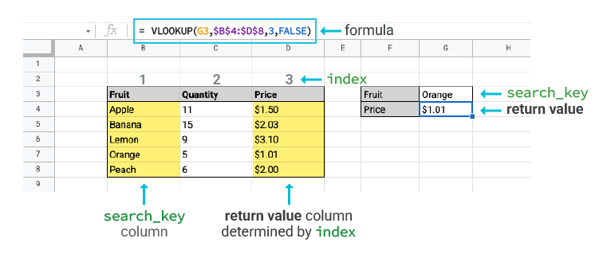
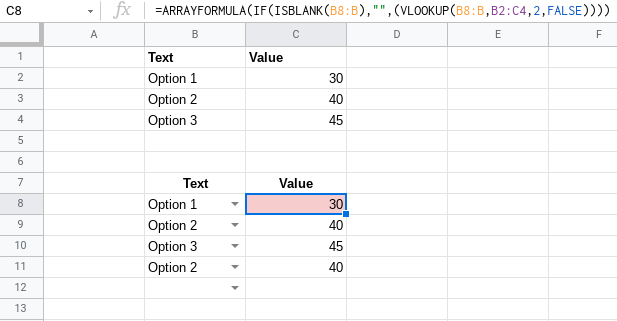
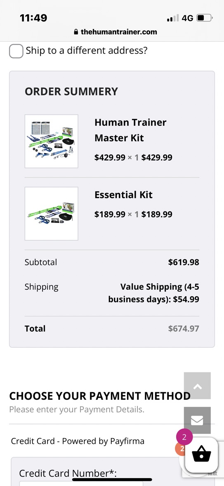

title:: Wanna/擁有好身材
public:: true

- date:: [[Sep 8th, 2022]]
  type:: #target-note
  name:: wanna/➡️  擁有好身材
  tags:: 每日推進
- ## TODOs
  collapsed:: true
	- {{query (and (todo todo doing later) (page [[wanna/➡️  擁有好身材]]))}}
- ## 目標的成功故事
	- 我想要成為一個，擁有健美身材，又抗老化的身體，至少遇到壞人時，還可以抗打擊或反抗
		- 早睡早起
		- 可以做到引體向上
		- 可以做到單手伏地挺身
		- 可以做到槍式深蹲
- ## 有何阻礙限制？
	- 常常偷懶，因為工作就沒有去健身房
		- 有替代方案，在家訓練，徒手健身
- ## 下一步行動
	- ### 學習課表設計
	  background-color:: purple
		- DONE 統計每個動作會動到的部位
		  :LOGBOOK:
		  CLOCK: [2022-09-24 Sat 13:54:23]--[2022-09-24 Sat 21:50:46] =>  07:56:23
		  :END:
			- 健身動作總表
			- 健身課表分配
			- 健身統計
		- 👉完善 [健身課表統計](https://docs.google.com/spreadsheets/d/1YDNEqcc73EBKq3TNaVccu_6DdpnYpp4CXCgdulp2hzE/edit#gid=341747128)
			- Google sheet 小撇步
			  collapsed:: true
				- Data Validation 新增 Filter 選單
				- Auto fill a cell on selection of dropdown list
					-
					- `VLOOKUP`
						- 
						- ```
						  =VLOOKUP({要填入的空格},'{資料來源表明}'!{資料來源格數FROM}:{資料來源格數TO},{index},{is sorted})
						  ```
						- `=VLOOKUP(C2,'健身動作總表'!A2:J,4,FALSE)`
					- 錯誤版本
						- collapsed:: true
						  ```
						  =ARRAYFORMULA(IF(ISBLANK(B8:B),"",(VLOOKUP(B8:B,B2:C4,2,FALSE))))
						  ```
							- 
							- 我的
								- ```
								  =ARRAYFORMULA(IF(ISBLANK(C2:C),"",(VLOOKUP(C2,'健身動作總表'!A2:J,4,FALSE))))
								  ```
								- 會 invalid，把 ARRAYFORMULA 移除就可以了
			- DONE 課表分配根據統計，篩選出缺乏的動作
			  :LOGBOOK:
			  CLOCK: [2022-10-10 Mon 18:28:33]--[2022-10-10 Mon 18:28:35] =>  00:00:02
			  :END:
			-
		-
	- ### 🐽 佛系減脂啦，每週減脂
	  background-color:: yellow
		- [佛系減脂來源：大H](https://www.youtube.com/watch?v=tgMNtCw6hRg&ab_channel=%E5%A4%A7H)
		- > 確診在家，變好肥
		- 透過量體重，監控自己身體變化
			- [佛系減脂體重紀錄](https://docs.google.com/spreadsheets/d/1YDNEqcc73EBKq3TNaVccu_6DdpnYpp4CXCgdulp2hzE/edit#gid=0)
				- #+BEGIN_TIP
				  睡前到隔天早上的體重，差約 1 KG，目前我的是差 0.6 KG
				  #+END_TIP
				- DONE 每天早上上完廁所、空腹量體重，並[記錄下來](https://docs.google.com/spreadsheets/d/1YDNEqcc73EBKq3TNaVccu_6DdpnYpp4CXCgdulp2hzE/edit#gid=0&range=E:E)
				- DONE 晚上睡前 3 小時量體重，水分在那之前要喝完，並[記錄下來](https://docs.google.com/spreadsheets/d/1YDNEqcc73EBKq3TNaVccu_6DdpnYpp4CXCgdulp2hzE/edit#gid=0&range=F:F)
				- TODO 可以吃小確幸嗎？
				  collapsed:: true
					- 從體重看今天吃的東西會不會太多或太少
						- 明天目標是 58 KG
							- ✅ 晚上量是 58.5 KG
								- 隔天早上會掉到 57.5 KG
								- 那晚上可以多吃些小確幸
							- ❌ 晚上量是 59KG
								- 因為隔天早上會掉到 58 KG
								- 晚上就不能小確幸囉
					- 小確幸可以自由挑選，大 H 最近吃：
						- 餅乾：看得到切痕、原形的
						- 巧克力：吃 95 %
				- TODO 每週驗收日：週日
					- 每週設定目標體重（ 0.5%~1%*體重)
					- 達到上週設定的目標
				- ~~計算哪時會達到 55 KG 的目標體重~~
					- 沒必要因為這是動態過程
			- 減脂速度
				- DONE 一～兩週，維持體重的情況下，記錄吃了哪些東西
					- 不用買體重機了
				- 一週不得減超過體重的 0.5%~1%
			- 不需要計算 TDEE，確定我要吃的熱量赤字熱量
			- 稍微減量但營養足夠
				- 不需要紀錄營養素
				- 觀察體態
				- 紀錄體重
			- 營養素足以應對生活、訓練與修復
				- 不需要減少高強度重量訓練
					- 原本可以推100，為什麼今天推不起來，是不是吃太少、水喝太少？
				- 熱量赤字不要太多，訓練量就不易下降
		- 前提條件
		  collapsed:: true
			- 一年以上的重訓，並且頻率要有4~5次以上
			- 計算基礎營養素的能力
				- 不能吃太多加工物
					- 牛排館就吃肉跟菜
					- 天然碳水可以吃
						- 米飯
						- 地瓜
						- 水果
				- 蛋白質: 體重的兩倍以上
				- 喝水: 體重 *  60 ~70 倍 cc
					- 包含所有的液態
		- 不用刻意做有氧、或停止有氧
		- 不要執行太有儀式感的減脂計畫
			- 不要有不舒服的感覺
			- 不要有太大的改變，因為改變是放棄最大個根源
			- 不要讓身體發現我在減脂
				- 進食時間
				- 份量
				- 種類
		- [[WONT]] [[Oct 1st, 2022]]  才能購買體重計精度要到 0.01 KG
		  collapsed:: true
			- [Momo【Dr.AV 聖岡科技】PT-2019 電子體重計 350元](https://www.momoshop.com.tw/goods/GoodsDetail.jsp?i_code=9447977&cid=recitri&oid=BfG&mdiv=goodsDetail_momoshop-av-&ctype=B&recomd_id=rgc-zhwp_normal_1664003765_345117219)
				- 最便宜，反正我也不需要 app 幫我計算
				- 蝦皮 $278 ，送蝦皮店到店
			- [Momo【TANITA】十合一體組成計BC-313 2880元](https://www.momoshop.com.tw/goods/GoodsDetail.jsp?i_code=8879711&str_category_code=1202300505&sourcePageType=4)
			- [Momo【OMG】家用智能電子體重計 USB充電式+光能充電體重秤 30cm 629元](https://www.momoshop.com.tw/goods/GoodsDetail.jsp?i_code=9944070&cid=recitri&oid=BfG&mdiv=goodsDetail_momoshop-av-&ctype=B&recomd_id=rgc-zbxx_normal_1664003944_9624573)
			  collapsed:: true
				- 中國的 APP? iOS 好像也沒有
				- 介紹影片是簡體字中國人，怕
	- ### 一週三次有氧，三次健身，至少 30 分鐘
	  background-color:: pink
		- #### 調整運動+生活作息做有氧
		  :LOGBOOK:
		  CLOCK: [2022-09-12 Mon 20:53:23]--[2022-09-13 Tue 20:47:03] =>  23:53:40
		  :END:
			- 最近都早睡晚起欸
				- [[Sep 25th, 2022]] 嘗試5點起床
			- TODO 整理 [[晚上回家後，可以有更多時間可以學習]]
			  collapsed:: true
				- > 嘗試了 1 個月，好像沒什麼實際上多出時間的感覺
				- 或許直接嘗試超早起？5:00~6:00
					- > 早起運動也有很多限制，像是運動完流汗要沖澡，會拖到出門上班的時間
			- 沒早起，改晚上運動
			  collapsed:: true
				- 早上起床：6:00
				- 晚上回家煮飯：7:30~8:15
				- 買飯回家吃：7:30~7:45
					- 半小時彈性應用時間：7:45~8:15
				- 吃飯：8:15~9:00
				- 運動：9:00~9:30
				- 晚上唸書：9:30~10:30
				- 洗澡就寢：10:30~11:30
			- 晚上沒運動，早起
			  collapsed:: true
				- 晚上睡覺 7 小時
					- 10 點就要睡了欸！？
					- 可行，但是晚上會一直被吵醒， [[Sep 13th, 2022]] 持續觀察精神狀態
					- 早起唸書 1 小時/1.5 小時
						- 5:00 起床，唸到 6:00~6:30
			- 棄用早起運動
			  collapsed:: true
				- 有早起運動(在家運動)
					- 煮飯： 6:30~ 7:00
					- 運動：7:00~7:30
					- 回家吃飯：7:30~8:15 (45分鐘)
					- 準備出門上班
				- 有早起運動(健身房)
					- 煮飯： 6:20~ 6:50
					- 出門運動: 6:54~7:00
					- 運動：7:00~7:30
					- 回家吃飯：7:36~8:16 (30分鐘)
					- 準備出門上班
		- ### 增肌練壯壯
		  background-color:: green
			- 每週每個部位練到15次，
			- 早上或晚上 30 分鐘運動
	- ### n分鐘備選方案：規劃在家訓練-徒手戰士
	  background-color:: purple
		- #### 槍式深蹲
			- TODO 計時一組10下幾分鐘
			- #### 箱上單腳深蹲 p.120
				- TODO 餐廳小板凳，左右腿各10下， [[Sep 7th, 2022]]
				- 進階訓練法 p.133
					- 第一組，抓在力竭前 1~2 下停止。一腳練完，休息1分鐘以上，再練另一隻腳。
					- 次數會大於10下，但因為行程較短，所以沒關係
					- 隨後將高度降低5公分，並開始下一組，持續降低箱子高度，直到覺得其中一下很吃力為止，再將高度加回去。
				- > 起立時，也可以練習單腿站立，小腿垂直地面，重心放腳根
			- #### 無離心收縮槍式深蹲 p.141
				- 徒手深蹲至最低點
				- 慢慢將一隻腳向前伸直
				- 向腹腔加壓，繃緊全身，以單腳站起
		- #### 單手伏地挺身
			- TODO 計時一組10下幾分鐘
			- 放一顆球，伏地挺身低到球的位置
	- #+BEGIN_PRIVATE
	- ### 量測In-Body 肌肉量上升 1kg [[Sep 4th, 2022]]
	  background-color:: red
	  collapsed:: true
		- DONE 一週最少三次健身各一個半小時
			- 固定日期：二、四、日
			- #### 規劃健身房訓練
				- 上半身
					- 增肌
						- Bench press
						- Incline bench press
						- Sited row
						- Kettlebell Turkish get up
						- Chest Fly
				- 下半身
				- 全身
				- 教練課
				- DONE 🚴‍♀️ 在家有氧
				  :LOGBOOK:
				  CLOCK: [2022-09-13 Tue 06:24:14]--[2022-09-13 Tue 08:50:13] =>  02:25:59
				  :END:
					- [[Sep 13th, 2022]]
						- 6KG 肩推 1 分鐘 12~8 下，共 10 分鐘
							- 推到後面，後肩胛代償有點太多的感覺，也有可能是家裡組合啞鈴感受度問題，啞鈴向上推時，會互相打到導致
						- 12 kg 深蹲 1 分鐘 12~10 下，共 10 分鐘
						- 單腿蹲彈力繩 row  3 組
			- 課表安排？
				- 有好多本書，要看哪本書？
					- DONE 看四周練出一肌，排出運動課表（上、下半身）
					- 課表安排設計
					- 臀肌
					- 肌肉金字塔
			- 避免有藉口
				- 拒絕喝酒要約
				- DONE [#A] 回南投買 TCF 格鬥會館的會員 [[Jul 28th, 2022]] #personal
		- 一週最少兩次有氧
			- DONE 一週兩次，滿足與 #@Nancy , #@Jason [[努力唸書運動]]的每週打賭
	- ### 回南投也不荒廢，30 次 TEFC 伊格斯運動會館 until [[Jul 27th, 2023]]
	  background-color:: yellow
	  collapsed:: true
		- 因為去年買了一年 2500 使用 30 次的課程，如果每次都有到的話，一次價格是 83 元，但我沒有做到。有可能只去了10次左右，一次應該也是會花 200 多，有點浪費錢。因此這次續約，想要特別的把這目標實踐，回南投一定要去健身房，不要浪費我購買的年費。
		- 不管是去有氧還是健身都可以打卡
		- ### 目前使用次數
			- <iframe src="https://indify.co/widgets/live/counter/wdZjnJaJhMyY4xgLLgIm"/>
		- ### 打卡
			- DONE [[Jul 28th, 2022]] 跑上半身課表
			- TODO 19:00~19:30 [[Jul 29th, 2022]] 想打卡有氧 30 分鐘 #habit-tracker
			- TODO [[Jul 30th, 2022]] 跑下半身課表
			-
	- #+END_PRIVATE
- ## 如何量化成果？
- ## 為誰為何而做？
	- 因為我想要健康
	  collapsed:: true
		- 因為想要抗老化
			- 因為想要家人也一起健康、抗老化
				- 因為不想要看到自己或家人，跟阿嬤一樣不能動臥病在床而終
					- 因為不想要抑鬱而老，卻什麼都不能做的感覺
- ## 暫時不做
	- ###  [[Aug 27th, 2022]]  開始每次回到/出去房間要做：
	  background-color:: #264c9b
	  collapsed:: true
	  :LOGBOOK:
	  CLOCK: [2022-08-27 Sat 14:38:57]
	  :END:
		- 回到房間都要做 5 下伏地挺身
			- <iframe src="https://indify.co/widgets/live/counter/DFgo6iBxgN5jZsmMXzLE" style="width: 50%; height: 50%"/>
			- 希望可以增加自己的胸肌
		- TRX 都要做 5 下拉背
			- <iframe src="https://indify.co/widgets/live/counter/4t325MLcx0DGDO5cGkEu" style="width: 50%; height: 50%"/>
			- 慢慢增加自己的背肌
			- [TRX 正版福利品](https://tw.bid.yahoo.com/item/%E3%80%90%E7%A6%8F%E5%88%A9%E5%93%81%E3%80%91TRX-PRO-%E5%B0%88%E6%A5%AD%E7%89%88%E6%87%B8%E5%90%8A%E8%A8%93%E7%B7%B4%E7%B5%84-%E3%80%90%E5%8F%B0%E7%81%A3%E7%B8%BD%E4%BB%A3%E7%90%86%E5%93%81-101216432798)
			  collapsed:: true
				- 7425 NTD
			- [The Human trainer master kit](https://www.thehumantrainer.com/product/human-trainer-master-kit/)
			  collapsed:: true
				- 
				- [比 TRX 好用](https://www.youtube.com/watch?v=rlz__p5Yy_A&ab_channel=SimmplyFit)，會偏向買它，因為兩手是分開的，door anchor 是一體的，還包含旋轉吊掛系統，以及一些額外的配件
				- [山姆大叔代購](https://shopee.tw/shop/5291963/)
					- 429 * 30.7 (匯率)* 1.08 (代購費用) = 14224
					- ```
					  國際運費依實際到庫量測為準，每磅含關稅運費210元
					  國內運費超取尺寸60，超過依黑貓宅配實際運費報價
					  ```加上運費
			- 先用家裡現有的盜版，然後等之後去上 TRX 課程後，再來買上面二擇一
-